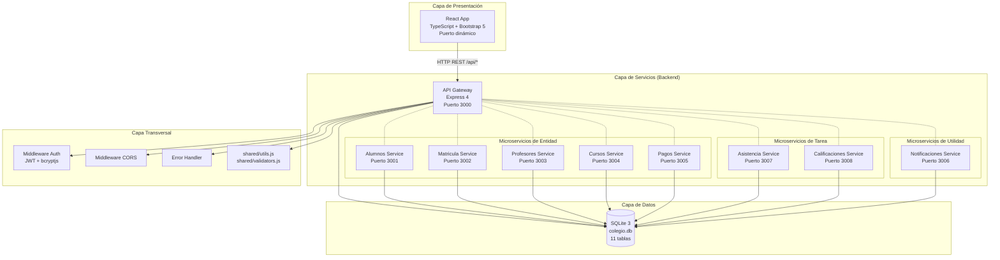
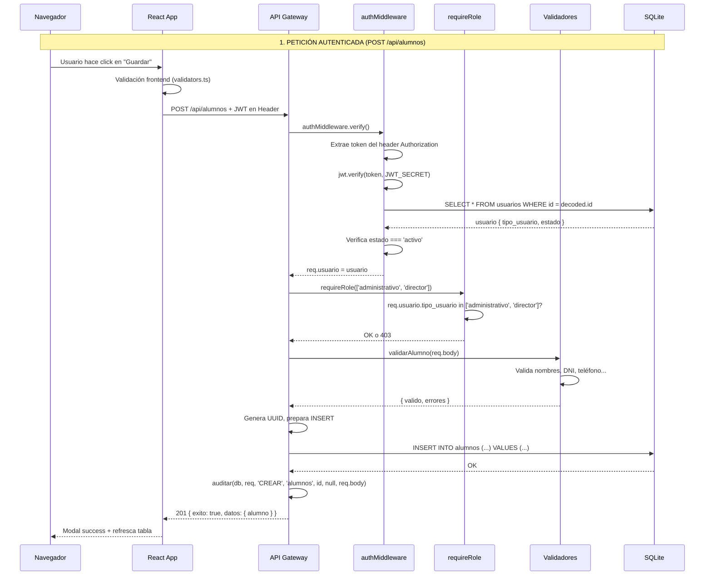
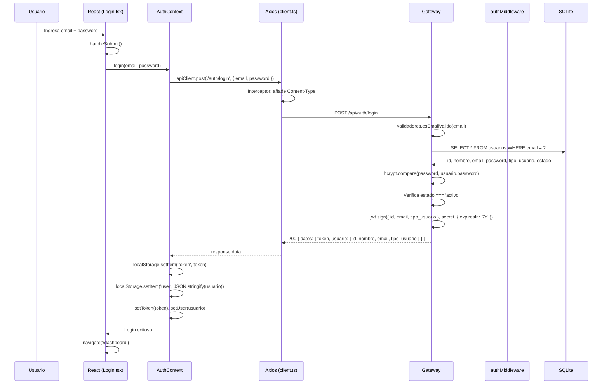
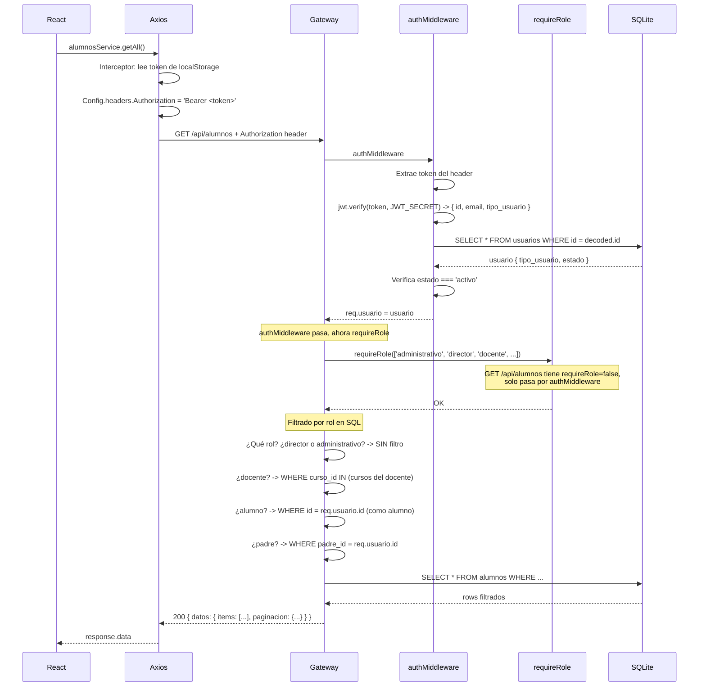
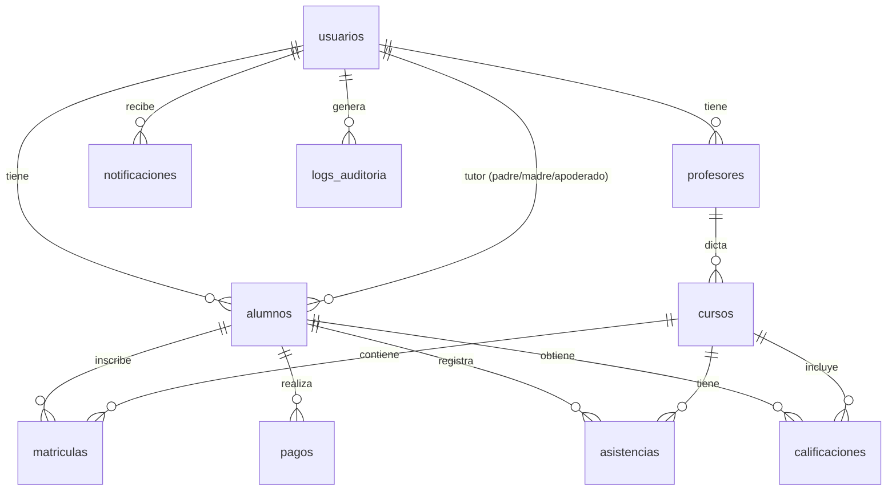
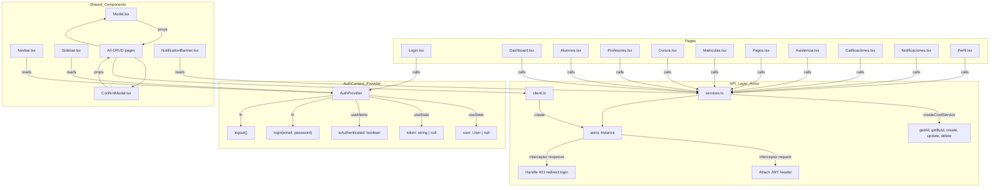
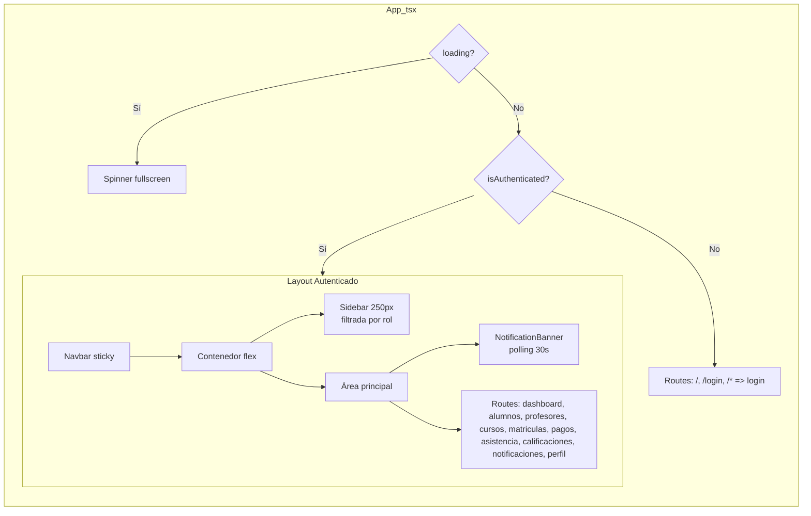
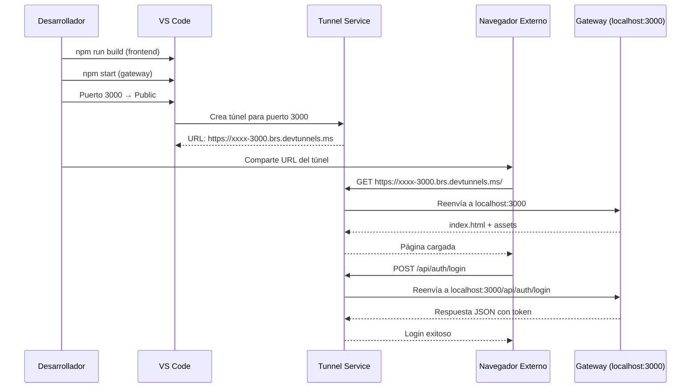

# Sistema SOA - Colegio Futuro Digital

Sistema de gestión académica basado en una **Arquitectura Orientada a Servicios (SOA)**. Implementa un **API Gateway** en Node.js/Express que centraliza autenticación JWT, autorización por roles, validación y lógica CRUD sobre una base de datos SQLite compartida. El frontend en **React 18 + TypeScript** consume los endpoints REST del Gateway.

---

## Arquitectura General

### Diagrama de Componentes



### Flujo de una Petición



> **Nota sobre la arquitectura actual:**
> El Gateway (`gateway.js`) contiene **toda la lógica CRUD activa** y consulta la base de datos directamente. Los 8 microservicios en `services/` existen como procesos Express independientes (cada uno con su propio puerto, sus propias rutas y lógica de negocio), pero el Gateway **no** les delega peticiones — todo el bloque de proxy (función `proxyServicio` + rutas) está deshabilitado dentro de un bloque `/* ... */` bajo la marca `DESHABILITADO - Usando BD directa`. Cada microservicio puede ejecutarse de forma autónoma y contiene validación, reglas de negocio y endpoints completos.

---

## Tech Stack — Detalle Técnico

### Backend

| Tecnología | Versión | Propósito | Módulo / Ubicación |
|-----------|---------|-----------|-------------------|
| **Node.js** | 18+ | Entorno de ejecución JavaScript del lado del servidor | — |
| **Express** | ^4.18.2 | Framework web para API REST | Gateway + 8 servicios |
| **SQLite3** | ^6.0.1 | Base de datos embebida (archivo `colegio.db`) | `config/database.js` |
| **jsonwebtoken** | ^9.0.0 | Creación y verificación de tokens JWT | `middleware/auth.js` |
| **bcryptjs** | ^2.4.3 | Hashing de contraseñas (10 rounds) | `middleware/auth.js`, `database/init.js` |
| **cors** | ^2.8.5 | Middleware CORS para Express | `gateway.js` |
| **dotenv** | ^16.0.3 | Carga de variables de entorno desde `.env` | `gateway.js` |
| **uuid** | ^14.0.0 | Generación de UUID v4 para IDs de entidades | `shared/utils.js` |
| **axios** | ^1.3.4 | Cliente HTTP (usado en asistencia-service para notificar inasistencias) | `services/*` |

### Frontend

| Tecnología | Versión | Propósito | Ubicación |
|-----------|---------|-----------|-----------|
| **React** | ^18.2.0 | Biblioteca UI (componentes funcionales + hooks) | `frontend/src/` |
| **TypeScript** | 5.x | Tipado estático estricto | `frontend/tsconfig.json` |
| **react-router-dom** | ^6.11.0 | Enrutamiento SPA (BrowserRouter, Routes, Route) | `App.tsx` |
| **axios** | ^1.4.0 | Cliente HTTP con interceptores | `api/client.ts` |
| **Bootstrap** | ^5.3.0 | Framework CSS (grid, formularios, modales, alerts) | `index.tsx` (importado) |
| **Bootstrap Icons** | ^1.11.0 | Iconos vectoriales (sidebar, navbar, botones) | Uso en todas las páginas |
| **react-scripts** | 5.0.1 | Build toolchain CRA (compilación, dev server, build) | `package.json` |

### Testing y Herramientas

| Herramienta | Versión | Propósito |
|------------|---------|-----------|
| **Jest** | ^29.5.0 | Framework de pruebas unitarias (0 archivos de test aún) |
| **supertest** | ^6.3.3 | Pruebas de integración HTTP (instalado, no usado) |
| **concurrently** | ^7.6.0 | Ejecución paralela de múltiples procesos (`npm run dev`) |
| **nodemon** | ^3.1.14 | Recarga automática en cambios de código |

---

## Funcionalidades del Sistema

### Módulos por Entidad

#### 1. Gestión de Alumnos
- CRUD completo (crear, leer, actualizar, eliminar)
- Validación: DNI (8 dígitos), teléfono (9 dígitos, empieza con 9), nombres (sin números, solo letras y tildes)
- Campos: matrícula, nombres, apellidos, documento, fecha de nacimiento, género, dirección, teléfono, email de contacto
- Vinculación con padres/apoderados (hasta 3 tutores: padre, madre, apoderado)
- Seguimiento de deuda pendiente y monto
- Asignación de aula y período académico
- Matrícula generada automáticamente con código correlativo (`MAT-2026-0001`)
- Filtrado por rol: director/administrativo ven todos; docente ve los de sus cursos; alumno ve solo su perfil; padre ve solo sus hijos

#### 2. Gestión de Profesores
- CRUD completo
- Validación: DNI (8 dígitos), teléfono (9 dígitos, empieza con 9), nombres
- Campos: nombres, apellidos, documento, especialidad, teléfono, fecha de contratación
- Estados: activo, inactivo, licencia
- Solo los roles `director` y `administrativo` pueden crear y actualizar profesores
- Filtrado por rol en consultas GET

#### 3. Gestión de Cursos
- CRUD completo
- Generación automática de código (`CUR-2026-0001`)
- Campos: nombre, código, grado (1ro-sec a 5to-sec), sección, profesor responsable, capacidad, salon, horario
- Control de capacidad (máximo de estudiantes por sección)
- Período académico asociado
- Estados: activo, cancelado, pausado

#### 4. Gestión de Matrículas
- CRUD (sin PUT)
- Registro de inscripción alumno-curso
- Restricción: un alumno no puede matricularse dos veces en el mismo curso/período (UNIQUE alumno_id + curso_id + periodo_academico)
- Estados: activa, cancelada, suspendida
- Solo administrativo y director pueden crear/cancelar

#### 5. Gestión de Pagos
- CRUD completo
- Conceptos predefinidos con montos fijos: Matrícula (S/230), Pensión Mensual (S/420), y concepto personalizado "Otro"
- Estados: pendiente, pagado, cancelado, rechazado
- Métodos de pago: tarjeta_credito, tarjeta_debito, transferencia, efectivo, cheque
- Seguimiento de deuda pendiente por alumno
- Actualización automática de `alumnos.deuda_pendiente` y `alumnos.monto_deuda`

#### 6. Gestión de Asistencia
- CRUD completo
- Estados: PRESENTE, FALTA, JUSTIFICADO
- Restricción: un registro por alumno/curso/fecha (UNIQUE alumno_id + curso_id + fecha)
- Validación: no duplicados por día
- Estadísticas: conteos de presentes, faltas, justificados, total
- Filtrado por rol: docente solo ve asistencia de sus cursos

#### 7. Gestión de Calificaciones
- CRUD completo
- Tipos de evaluación: parcial, final, extra
- Rango de nota: 0 a 20
- Pesos configurables para cálculo de promedios
- Período académico asociado
- Estados: pendiente, registrada, revisada
- Badge por rango de nota: 15+ excelente, 11+ aprobado, 6+ en desarrollo, <6 desaprobado
- Filtrado por rol: docente solo ve notas de sus cursos

#### 8. Gestión de Notificaciones
- CRUD (sin PUT para crear, pero toggle leído/no leído vía PUT)
- Tipos: alerta, información, recordatorio
- Estados: pendiente, enviado, fallido, leído
- Banner de notificaciones no leídas al iniciar sesión (pooling cada 30 segundos)
- Botón para marcar como leída/no leída desde la tabla
- Filtrado por rol: director/administrativo ven todas; demás roles ven solo las suyas

### Funcionalidades Transversales

#### Autenticación y Seguridad
- Login con email/contraseña
- JWT con expiración de 7 días (configurable)
- Passwords hasheados con bcryptjs (10 rounds)
- Middleware de autenticación (`authMiddleware`) en todas las rutas protegidas
- Middleware de autorización por rol (`requireRole(roles)`)
- Filtrado por rol en consultas SQL (cada GET devuelve solo datos permitidos)

#### Validación
- **Frontend** (`frontend/src/utils/validators.ts`): validación en tiempo real al escribir
- **Backend** (`shared/validators.js`): validación server-side antes de INSERT/UPDATE
- **Feedback visual**: campos con clase `is-invalid` + mensajes `invalid-feedback` de Bootstrap
- **Errores en modal**: mensajes de error y éxito aparecen dentro del modal, no detrás

#### Interfaz de Usuario
- Sidebar dinámico que se adapta según el rol (oculta opciones no permitidas)
- Tablas ordenables haciendo clic en encabezados (asc/desc)
- Modal reutilizable con soporte para error/success integrado
- Confirmación antes de eliminar (ConfirmModal)
- Diseño responsive con Bootstrap 5

#### Auditoría
- Tabla `logs_auditoria` en la base de datos (con columnas: usuario, acción, tabla, registro_id, datos antes/después, IP, fecha)
- Función `auditar()` en `shared/utils.js` — wrapper seguro que nunca interrumpe la operación principal
- **Completamente integrada** en todos los endpoints POST, PUT y DELETE del Gateway para las 8 entidades
- Cada operación registra: usuario que ejecutó, acción (CREAR/ACTUALIZAR/ELIMINAR), tabla afectada, ID del registro, y snapshot de datos antes/después (JSON)

---

## Inicio Rápido — Paso a Paso

### Prerrequisitos

- **Node.js** 16 o superior
- **npm** 7 o superior
- **Git** (opcional)
- **Docker Desktop** (solo si usas contenedores)

### Instalación

```bash
# 1. Clonar el repositorio (si aplica)
git clone <repo-url>
cd SOA

# 2. Instalar dependencias del backend (raíz)
npm install

# 3. Instalar dependencias del frontend
cd frontend
npm install
cd ..

# 4. Configurar variables de entorno
copy .env.example .env
# Editar .env si es necesario (JWT_SECRET, DB_PATH, etc.)

# 5. Inicializar base de datos con datos de prueba
npm run db:init
# Esto crea 11 tablas y siembra: ~46 usuarios, 10 profesores, 20 alumnos,
# ~31 cursos, ~72 matrículas, ~59 pagos, ~72 asistencias, ~72 calificaciones, 7 notificaciones
```

### Ejecución en Desarrollo

```bash
# Terminal 1: Backend (Gateway + 8 servicios)
npm run dev
# Inicia 9 procesos con concurrently + nodemon
# Gateway: http://localhost:3000
# Alumnos: http://localhost:3001
# Matrícula: http://localhost:3002
# ...

# Terminal 2: Frontend (React dev server)
cd frontend && npm start
# Normalmente http://localhost:3001 (si 3000 está ocupado)
```

### Ejecución en Producción (Build + Gateway)

```bash
# 1. Compilar frontend
cd frontend && npm run build && cd ..

# 2. Iniciar solo el Gateway (sirve build + API)
npm start
# Gateway en http://localhost:3000
# Sirve tanto la API (/api/*) como el frontend compilado (cualquier otra ruta)
```

### Docker

```bash
docker compose up --build
# Inicia 9 contenedores que comparten un volumen SQLite
```

---

## Autenticación y Autorización — Flujo Completo

### 1. Registro / Login



### 2. Peticiones Autenticadas (ej: GET /api/alumnos)



### 3. Middleware Chain Completo

```
Petición entrante
    │
    ▼
┌─────────────────┐
│   cors()         │  ← Configura CORS según origen
│   (gateway.js)   │
└────────┬─────────┘
         ▼
┌─────────────────┐
│   express.json() │  ← Parsea body como JSON
└────────┬─────────┘
         ▼
┌─────────────────┐
│   express.static │  ← Sirve archivos estáticos
│   (2 directorios)│     (build/ + public/)
└────────┬─────────┘
         ▼
┌──────────────────────┐
│   authMiddleware()    │  ← Verifica JWT (si existe ruta)
│   (middleware/auth.js)│
└────────┬─────────────┘
         ▼
┌──────────────────────┐
│   requireRole(roles)  │  ← Verifica tipo_usuario
│   (middleware/auth.js)│     (si aplica a la ruta)
└────────┬─────────────┘
         ▼
┌──────────────────────┐
│   Route Handler      │  ← Lógica CRUD + consulta BD
│   (gateway.js)       │
└────────┬─────────────┘
         ▼
┌──────────────────────┐
│   respuestaE xito()   │  ← Formatea respuesta JSON
│   o respuestaError()   │
└────────┬─────────────┘
         ▼
    Respuesta al cliente
```

### Payload del JWT

```json
// Decodificado
{
  "id": "550e8400-e29b-41d4-a716-446655440000",
  "email": "luis.herrera@colegiofuturo.edu",
  "tipo_usuario": "director",
  "iat": 1748380800,
  "exp": 1748985600
}
```

### Códigos de Error de Autenticación

| Código | HTTP | Causa |
|--------|------|-------|
| `TOKEN_REQUIRED` | 401 | No se envió token en el header |
| `TOKEN_EXPIRED` | 401 | El token ha expirado |
| `INVALID_TOKEN` | 401 | Token inválido o malformado |
| `USER_NOT_FOUND` | 401 | El usuario del token ya no existe |
| `USER_BLOCKED` | 403 | El usuario está bloqueado/inactivo |
| `INSUFFICIENT_ROLE` | 403 | El rol no tiene permiso para la acción |
| `INVALID_CREDENTIALS` | 401 | Email o contraseña incorrectos |

---

## Roles y Permisos — Matriz Completa

### Definición de Roles

| Rol | Descripción | Código en BD |
|-----|-------------|--------------|
| Director | Director general del colegio, acceso total | `director` |
| Administrativo | Personal administrativo y de control académico | `administrativo` |
| Docente | Profesor a cargo de cursos | `docente` |
| Alumno | Estudiante matriculado | `alumno` |
| Padre | Apoderado/tutor de uno o más estudiantes | `padre` |

### Matriz de Permisos (Frontend + Backend)

| Recurso | Acción | director | administrativo | docente | alumno | padre |
|---------|--------|----------|----------------|---------|--------|-------|
| **Dashboard** | Ver | ✅ | ✅ | ✅ | ✅ | ✅ |
| **Alumnos** | Ver todos | ✅ | ✅ | ✅ (solo sus cursos) | ❌ | ❌ |
| **Alumnos** | Ver propio | ✅ | ✅ | ✅ | ✅ | ✅ (sus hijos) |
| **Alumnos** | Crear | ✅ | ✅ | ❌ | ❌ | ❌ |
| **Alumnos** | Editar | ✅ | ✅ | ❌ | ❌ | ❌ |
| **Alumnos** | Eliminar | ✅ | ✅ | ❌ | ❌ | ❌ |
| **Profesores** | Ver | ✅ | ✅ | ✅ (solo sí mismo) | ✅ (solo sus profes) | ✅ (solo profes de hijos) |
| **Profesores** | Crear | ✅ | ✅ | ❌ | ❌ | ❌ |
| **Profesores** | Editar | ✅ | ✅ | ❌ | ❌ | ❌ |
| **Profesores** | Eliminar | ✅ | ✅ | ❌ | ❌ | ❌ |
| **Cursos** | Ver | ✅ | ✅ | ✅ (solo los suyos) | ✅ (solo matriculados) | ✅ (solo de hijos) |
| **Cursos** | Crear | ✅ | ✅ | ❌ | ❌ | ❌ |
| **Cursos** | Editar | ✅ | ✅ | ❌ | ❌ | ❌ |
| **Cursos** | Eliminar | ✅ | ✅ | ❌ | ❌ | ❌ |
| **Matrículas** | Ver | ✅ | ✅ | ✅ (solo sus cursos) | ✅ (solo propia) | ✅ (solo de hijos) |
| **Matrículas** | Crear | ✅ | ✅ | ❌ | ❌ | ❌ |
| **Matrículas** | Eliminar | ✅ | ✅ | ❌ | ❌ | ❌ |
| **Pagos** | Ver | ✅ | ✅ | ✅ (solo sus cursos) | ✅ (solo propios) | ✅ (solo de hijos) |
| **Pagos** | Crear | ✅ | ✅ | ✅ | ✅ | ✅ |
| **Pagos** | Editar | ✅ | ✅ | ✅ | ✅ | ✅ |
| **Pagos** | Eliminar | ✅ | ✅ | ❌ | ❌ | ❌ |
| **Asistencia** | Ver | ✅ | ✅ | ✅ (solo sus cursos) | ✅ (solo propia) | ✅ (solo de hijos) |
| **Asistencia** | Crear | ✅ | ✅ | ✅ | ❌ | ❌ |
| **Asistencia** | Editar | ✅ | ✅ | ✅ | ❌ | ❌ |
| **Asistencia** | Eliminar | ✅ | ✅ | ✅ | ❌ | ❌ |
| **Calificaciones** | Ver | ✅ | ✅ | ✅ (solo sus cursos) | ✅ (solo propias) | ✅ (solo de hijos) |
| **Calificaciones** | Crear | ✅ | ✅ | ✅ | ❌ | ❌ |
| **Calificaciones** | Editar | ✅ | ✅ | ✅ | ❌ | ❌ |
| **Calificaciones** | Eliminar | ✅ | ✅ | ✅ | ❌ | ❌ |
| **Notificaciones** | Ver | ✅ | ✅ | ✅ (solo propias) | ✅ (solo propias) | ✅ (solo propias) |
| **Notificaciones** | Crear | ✅ | ✅ | ✅ | ❌ | ❌ |
| **Notificaciones** | Editar | ✅ | ✅ | ✅ | ✅ (marcar leída) | ✅ (marcar leída) |
| **Notificaciones** | Eliminar | ✅ | ✅ | ✅ | ❌ | ❌ |
| **Usuarios** | Ver | ✅ | ✅ | ❌ | ❌ | ❌ |
| **Perfil** | Ver propio | ✅ | ✅ | ✅ | ✅ | ✅ |

### Implementación en Backend

El Gateway define en `gateway.js`:
```javascript
const ROLES_CON_ACCESO_TOTAL = new Set(['director', 'administrativo']);
```

Para cada GET, la lógica de filtrado es:
- **director / administrativo**: `SELECT ...` sin filtro WHERE adicional
- **docente**: Obtiene los IDs de cursos del profesor, luego filtra por esos cursos
- **alumno**: Filtra por `alumnos.usuario_id = req.usuario.id`
- **padre**: Obtiene los IDs de alumnos donde `padre_id = req.usuario.id` (o madre_id, apoderado_id)

Para POST/PUT/DELETE, se usa `requireRole(rolesPermitidos)`:
```javascript
app.post('/api/alumnos', requireRole(['administrativo', 'director']), asyncHandler(async (req, res) => { ... }));
```

---

## API — Referencia Completa

### Formato de Respuestas

Todas las respuestas siguen el formato definido en `shared/utils.js`:

```javascript
// Éxito
{
  "exito": true,
  "codigo": "OPERATION_SUCCESS",
  "mensaje": "Alumno creado correctamente",
  "datos": { ... }  // opcional
}

// Error
{
  "exito": false,
  "codigo": "VALIDATION_ERROR",
  "mensaje": "Error de validación",
  "detalles": ["El campo 'numero_documento' debe tener 8 dígitos"]
}
```

### Autenticación

#### POST /api/auth/login

Inicia sesión con email y contraseña. Devuelve un token JWT y datos del usuario.

**Request:**
```json
{
  "email": "luis.herrera@colegiofuturo.edu",
  "password": "password123"
}
```

**Response (200):**
```json
{
  "exito": true,
  "codigo": "LOGIN_SUCCESS",
  "mensaje": "Login exitoso",
  "datos": {
    "token": "eyJhbGciOiJIUzI1NiIsInR5cCI6IkpXVCJ9...",
    "usuario": {
      "id": "550e8400-e29b-41d4-a716-446655440000",
      "nombre": "Dr. Luis Fernando Herrera",
      "email": "luis.herrera@colegiofuturo.edu",
      "tipo_usuario": "director"
    }
  }
}
```

**Response (401):**
```json
{
  "exito": false,
  "codigo": "INVALID_CREDENTIALS",
  "mensaje": "Contraseña incorrecta"
}
```

#### POST /api/auth/registro

Registra un nuevo usuario. Requiere cuerpo con nombre, email, password y tipo_usuario.

**Request:**
```json
{
  "nombre": "Nuevo Usuario",
  "email": "nuevo@colegiofuturo.edu",
  "password": "Password1",
  "tipo_usuario": "docente"
}
```

### Alumnos

#### GET /api/alumnos

Lista de alumnos con paginación. Filtrada según el rol del usuario autenticado.

**Query Parameters:**
| Parámetro | Default | Descripción |
|-----------|---------|-------------|
| `pagina` | 1 | Número de página (1-indexed) |
| `limite` | 10 | Elementos por página (máx 100) |

**Response (200):**
```json
{
  "exito": true,
  "datos": {
    "items": [
      {
        "id": "uuid",
        "numero_matricula": "MAT-2026-0001",
        "apellido_paterno": "Sanchez",
        "apellido_materno": "Lopez",
        "primer_nombre": "Valeria",
        "segundo_nombre": "Andrea",
        "numero_documento": "41234567",
        "telefono": "999888777",
        "email_contacto": null,
        "fecha_nacimiento": "2008-05-15",
        "genero": "F",
        "direccion": "Av. Principal 123",
        "estado": "activo",
        "deuda_pendiente": false,
        "monto_deuda": 0,
        "padre_id": "uuid-del-padre",
        "datos_completos": true,
        "fecha_creacion": "2026-03-10 08:00:00"
      }
    ],
    "paginacion": {
      "pagina": 1,
      "limite": 10,
      "total": 8,
      "total_paginas": 1
    }
  }
}
```

#### POST /api/alumnos

Crea un nuevo alumno. Requiere rol administrativo o director.

**Request:**
```json
{
  "usuario_id": "uuid-del-usuario",
  "apellido_paterno": "Garcia",
  "apellido_materno": "Martinez",
  "primer_nombre": "Carlos",
  "segundo_nombre": "Alberto",
  "numero_documento": "12345678",
  "telefono": "987654321",
  "fecha_nacimiento": "2009-08-20",
  "genero": "M",
  "direccion": "Calle Los Olivos 456",
  "email_contacto": "carlos.garcia@email.com"
}
```

**Response (201):**
```json
{
  "exito": true,
  "codigo": "ALUMNO_CREADO",
  "mensaje": "Alumno creado correctamente",
  "datos": {
    "alumno": {
      "id": "nuevo-uuid",
      "numero_matricula": "MAT-2026-0009",
      "apellido_paterno": "Garcia",
      "primer_nombre": "Carlos",
      "numero_documento": "12345678",
      "estado": "activo"
    }
  }
}
```

**Response (400) — Error de validación:**
```json
{
  "exito": false,
  "codigo": "VALIDATION_ERROR",
  "mensaje": "Error de validación",
  "detalles": [
    "El campo 'numero_documento' debe tener exactamente 8 dígitos",
    "El campo 'telefono' debe tener exactamente 9 dígitos y empezar con 9"
  ]
}
```

#### PUT /api/alumnos/:id

Actualiza un alumno existente. Los campos opcionales se omiten si no se envían.

#### DELETE /api/alumnos/:id

Elimina un alumno y en cascada: matrículas, pagos, asistencias, calificaciones y notificaciones asociadas.

### Profesores

#### GET /api/profesores

Lista de profesores con paginación y filtrado por rol.

#### POST /api/profesores

Crea un nuevo profesor. Requiere rol **director** o **administrativo**.

**Request:**
```json
{
  "usuario_id": "uuid-del-usuario",
  "apellido_paterno": "Ramirez",
  "apellido_materno": "Torres",
  "primer_nombre": "Ana",
  "segundo_nombre": "Maria",
  "numero_documento": "87654321",
  "especialidad": "Matematica",
  "telefono": "987654321",
  "fecha_contratacion": "2026-03-01"
}
```

#### PUT /api/profesores/:id
Solo director o administrativo. Actualiza datos del profesor.

#### DELETE /api/profesores/:id
Solo administrativo o director. Elimina profesor y sus cursos asociados.

### Cursos

#### GET /api/cursos

Lista de cursos. Los docentes ven solo sus cursos; alumnos ven solo los matriculados; padres ven solo los de sus hijos.

#### POST /api/cursos

Crea un nuevo curso. Requiere director o administrativo.

**Request:**
```json
{
  "codigo": "CUR-2026-0010",
  "nombre": "Matematica Avanzada",
  "grado": "5to-sec",
  "seccion": "A",
  "profesor_id": "uuid-del-profesor",
  "capacidad": 35,
  "salon": "D-101"
}
```

#### PUT /api/cursos/:id
#### DELETE /api/cursos/:id

### Matrículas

#### POST /api/matriculas

Inscribe un alumno en un curso. Valida que no exista duplicado (mismo alumno, curso y período).

**Request:**
```json
{
  "alumno_id": "uuid-del-alumno",
  "curso_id": "uuid-del-curso",
  "periodo_academico": "2026-1",
  "fecha_matricula": "2026-03-15",
  "estado": "activa"
}
```

#### DELETE /api/matriculas/:id
Cancela una matrícula.

### Pagos

#### POST /api/pagos

Registra un pago. Cualquier usuario autenticado puede crear pagos.

**Request:**
```json
{
  "alumno_id": "uuid-del-alumno",
  "monto": 420.00,
  "concepto": "Pension Mensual - Junio",
  "periodo_academico": "2026-1",
  "estado": "pagado",
  "fecha_vencimiento": "2026-06-15",
  "fecha_pago": "2026-06-10",
  "metodo_pago": "transferencia",
  "referencia_pago": "TRA-2026-00421"
}
```

#### PUT /api/pagos/:id
#### DELETE /api/pagos/:id

### Asistencia

#### POST /api/asistencia

Registra asistencia. Valida que no exista duplicado para el mismo alumno/curso/fecha.

**Request:**
```json
{
  "alumno_id": "uuid-del-alumno",
  "curso_id": "uuid-del-curso",
  "fecha": "2026-06-15",
  "estado": "PRESENTE",
  "motivo_falta": null
}
```

#### PUT /api/asistencia/:id

**Request:**
```json
{
  "estado": "JUSTIFICADO",
  "motivo_falta": "Cita medica"
}
```

#### DELETE /api/asistencia/:id

### Calificaciones

#### POST /api/calificaciones

Registra una calificación. Nota debe estar entre 0 y 20.

**Request:**
```json
{
  "alumno_id": "uuid-del-alumno",
  "curso_id": "uuid-del-curso",
  "tipo_evaluacion": "parcial",
  "puntuacion": 15.5,
  "peso": 1.0,
  "observaciones": "Buen desempeño en el examen parcial",
  "periodo_academico": "2026-1"
}
```

#### PUT /api/calificaciones/:id
#### DELETE /api/calificaciones/:id

### Notificaciones

#### POST /api/notificaciones

Crea una notificación para un usuario.

**Request:**
```json
{
  "destinatario_id": "uuid-del-usuario",
  "tipo": "informacion",
  "mensaje": "Estimado padre, recuerde que el pago de pension vence el 15 de julio."
}
```

#### PUT /api/notificaciones/:id

Permite cambiar el estado (especialmente marcar como leída).

**Request (marcar como leída):**
```json
{
  "leida": true
}
```

**Response:**
```json
{
  "exito": true,
  "mensaje": "Notificación actualizada",
  "datos": {
    "id": "uuid",
    "leida": true,
    "fecha_lectura": "2026-06-15 14:30:00"
  }
}
```

#### DELETE /api/notificaciones/:id

### Utilidad

#### GET /api/me

Devuelve los datos del usuario autenticado actual.

**Response:**
```json
{
  "exito": true,
  "datos": {
    "id": "uuid",
    "nombre": "Dr. Luis Fernando Herrera",
    "email": "luis.herrera@colegiofuturo.edu",
    "tipo_usuario": "director",
    "estado": "activo",
    "fecha_creacion": "2026-01-01 00:00:00"
  }
}
```

#### GET /api/health

Health check. No requiere autenticación.

**Response:**
```json
{
  "status": "OK",
  "timestamp": "2026-07-02T12:00:00.000Z",
  "servicios": {
    "alumnos": "http://localhost:3001",
    "matricula": "http://localhost:3002",
    "profesores": "http://localhost:3003",
    "cursos": "http://localhost:3004",
    "pagos": "http://localhost:3005",
    "notificaciones": "http://localhost:3006",
    "asistencia": "http://localhost:3007",
    "calificaciones": "http://localhost:3008"
  }
}
```

---

## Base de Datos — Esquema Detallado

### Tecnología
- **Motor:** SQLite 3 (embedded, sin servidor)
- **Archivo:** `database/colegio.db` (configurable vía `DB_PATH` en `.env`)
- **Driver:** `sqlite3` (versión 6.0.1)
- **Conexión:** `config/database.js` — exporta helpers promisificados (`getOne`, `getAll`, `runQuery`)

### Helper de Base de Datos

`config/database.js` exporta:

```javascript
// Obtener una fila
getOne('SELECT * FROM usuarios WHERE email = ?', [email])
// → { id, nombre, email, tipo_usuario, ... } o undefined

// Obtener múltiples filas
getAll('SELECT * FROM alumnos WHERE estado = ?', ['activo'])
// → [{ id, nombre, ... }, { id, nombre, ... }, ...]

// Ejecutar INSERT / UPDATE / DELETE
runQuery('INSERT INTO alumnos (id, ...) VALUES (?, ...)', [uuid, ...])
// → { changes: 1, lastID: ... }
```

### Diagrama Entidad-Relación



### Descripción de Tablas

#### `usuarios`
Almacena las cuentas de todos los usuarios del sistema. Cada persona (director, administrativo, docente, alumno, padre) tiene un registro aquí.

| Campo | Tipo | Restricciones | Descripción |
|-------|------|---------------|-------------|
| `id` | TEXT | PK | UUID v4 |
| `nombre` | TEXT | NOT NULL | Nombre completo |
| `email` | TEXT | UNIQUE, NOT NULL | Correo institucional (usado para login) |
| `password` | TEXT | NOT NULL | Hash bcrypt (10 rounds) |
| `tipo_usuario` | TEXT | NOT NULL, CHECK | `alumno`, `docente`, `administrativo`, `padre`, `director` |
| `estado` | TEXT | DEFAULT 'activo' | `activo`, `inactivo`, `bloqueado` |
| `fecha_creacion` | DATETIME | DEFAULT CURRENT_TIMESTAMP | — |
| `fecha_actualizacion` | DATETIME | DEFAULT CURRENT_TIMESTAMP | — |

**Índices:** `idx_usuarios_email` (único), `idx_usuarios_tipo`, `idx_usuarios_estado`

---

#### `alumnos`
Datos específicos de los estudiantes. Vinculados a un usuario y opcionalmente a hasta 3 tutores (padre, madre, apoderado).

| Campo | Tipo | Restricciones | Descripción |
|-------|------|---------------|-------------|
| `id` | TEXT | PK | UUID v4 |
| `usuario_id` | TEXT | UNIQUE, NOT NULL, FK→usuarios(id) | Cuenta de usuario asociada |
| `numero_matricula` | TEXT | UNIQUE | Código de matrícula (ej: MAT-2026-0001) |
| `apellido_paterno` | TEXT | NOT NULL | Apellido paterno |
| `apellido_materno` | TEXT | — | Apellido materno |
| `primer_nombre` | TEXT | NOT NULL | Primer nombre |
| `segundo_nombre` | TEXT | — | Segundo nombre |
| `fecha_nacimiento` | DATE | — | Fecha de nacimiento |
| `numero_documento` | TEXT | UNIQUE | DNI (8 dígitos) |
| `genero` | TEXT | CHECK(`M`, `F`, `Otro`) | Género |
| `direccion` | TEXT | — | Dirección de domicilio |
| `telefono` | TEXT | — | Teléfono de contacto |
| `email_contacto` | TEXT | — | Email alternativo |
| `padre_id` | TEXT | FK→usuarios(id) | Tutor padre |
| `madre_id` | TEXT | FK→usuarios(id) | Tutor madre |
| `apoderado_id` | TEXT | FK→usuarios(id) | Tutor apoderado |
| `datos_completos` | BOOLEAN | DEFAULT FALSE | Flag de datos completados |
| `deuda_pendiente` | BOOLEAN | DEFAULT FALSE | Indica si tiene deuda |
| `monto_deuda` | DECIMAL(10,2) | DEFAULT 0.00 | Monto total de deuda |
| `aula_asignada` | BOOLEAN | DEFAULT FALSE | Si tiene aula asignada |
| `aula_id` | TEXT | — | ID del aula asignada |
| `periodo_academico` | TEXT | — | Período actual (ej: 2026-1) |
| `estado` | TEXT | DEFAULT 'activo' | `activo`, `inactivo`, `egresado` |
| `fecha_creacion` | DATETIME | DEFAULT CURRENT_TIMESTAMP | — |
| `fecha_actualizacion` | DATETIME | DEFAULT CURRENT_TIMESTAMP | — |

**Índices:** `idx_alumnos_usuario_id`, `idx_alumnos_numero_documento`, `idx_alumnos_deuda_pendiente`, `idx_alumnos_aula_asignada`, `idx_alumnos_periodo`

---

#### `profesores`
Datos específicos de los docentes.

| Campo | Tipo | Restricciones | Descripción |
|-------|------|---------------|-------------|
| `id` | TEXT | PK | UUID v4 |
| `usuario_id` | TEXT | UNIQUE, NOT NULL, FK→usuarios(id) | Cuenta de usuario asociada |
| `apellido_paterno` | TEXT | NOT NULL | Apellido paterno |
| `apellido_materno` | TEXT | — | Apellido materno |
| `primer_nombre` | TEXT | NOT NULL | Primer nombre |
| `segundo_nombre` | TEXT | — | Segundo nombre |
| `numero_documento` | TEXT | UNIQUE | DNI (8 dígitos) |
| `especialidad` | TEXT | — | Especialidad / área (ej: Matematica, Comunicacion) |
| `telefono` | TEXT | — | Teléfono de contacto |
| `estado` | TEXT | DEFAULT 'activo' | `activo`, `inactivo`, `licencia` |
| `fecha_contratacion` | DATE | — | Fecha de inicio laboral |
| `fecha_creacion` | DATETIME | DEFAULT CURRENT_TIMESTAMP | — |
| `fecha_actualizacion` | DATETIME | DEFAULT CURRENT_TIMESTAMP | — |

**Índices:** `idx_profesores_usuario_id`, `idx_profesores_numero_documento`

---

#### `cursos`
Catálogo de cursos/secciones ofrecidos.

| Campo | Tipo | Restricciones | Descripción |
|-------|------|---------------|-------------|
| `id` | TEXT | PK | UUID v4 |
| `codigo` | TEXT | UNIQUE, NOT NULL | Código del curso (ej: SEC-1A) |
| `nombre` | TEXT | NOT NULL | Nombre del curso |
| `descripcion` | TEXT | — | Descripción del curso |
| `grado_nivel` | TEXT | NOT NULL | Grado (ej: 1ro-sec, 2do-sec, ..., 5to-sec) |
| `seccion` | TEXT | — | Sección (A, B, etc.) |
| `profesor_id` | TEXT | NOT NULL, FK→profesores(id) | Profesor asignado |
| `capacidad_maxima` | INT | DEFAULT 40 | Cupo máximo de estudiantes |
| `capacidad_actual` | INT | DEFAULT 0 | Estudiantes inscritos actualmente |
| `aula_asignada` | TEXT | — | Aula / salón (ej: A-101) |
| `horario_inicio` | TIME | — | Hora de inicio |
| `horario_fin` | TIME | — | Hora de fin |
| `periodo_academico` | TEXT | NOT NULL | Período académico (ej: 2026-1) |
| `estado` | TEXT | DEFAULT 'activo' | `activo`, `cancelado`, `pausado` |
| `fecha_creacion` | DATETIME | DEFAULT CURRENT_TIMESTAMP | — |
| `fecha_actualizacion` | DATETIME | DEFAULT CURRENT_TIMESTAMP | — |

**Índices:** `idx_cursos_profesor_id`, `idx_cursos_periodo`, `idx_cursos_estado`

---

#### `matriculas`
Relación alumno-curso. Un alumno puede estar en múltiples cursos pero solo una vez por curso/período.

| Campo | Tipo | Restricciones | Descripción |
|-------|------|---------------|-------------|
| `id` | TEXT | PK | UUID v4 |
| `alumno_id` | TEXT | NOT NULL, FK→alumnos(id) | Estudiante |
| `curso_id` | TEXT | NOT NULL, FK→cursos(id) | Curso |
| `aula_asignada` | TEXT | — | Aula específica asignada |
| `periodo_academico` | TEXT | NOT NULL | Período (ej: 2026-1) |
| `fecha_matricula` | DATETIME | DEFAULT CURRENT_TIMESTAMP | Fecha de inscripción |
| `estado` | TEXT | DEFAULT 'activa' | `activa`, `cancelada`, `suspendida` |
| `fecha_creacion` | DATETIME | DEFAULT CURRENT_TIMESTAMP | — |
| `fecha_actualizacion` | DATETIME | DEFAULT CURRENT_TIMESTAMP | — |

**Índices:** `idx_matriculas_alumno_id`, `idx_matriculas_curso_id`, `idx_matriculas_periodo`, `idx_matriculas_estado`
**Unique:** `UNIQUE(alumno_id, curso_id, periodo_academico)` — evita duplicados

---

#### `pagos`
Registro de pagos y deudas de estudiantes.

| Campo | Tipo | Restricciones | Descripción |
|-------|------|---------------|-------------|
| `id` | TEXT | PK | UUID v4 |
| `alumno_id` | TEXT | NOT NULL, FK→alumnos(id) | Estudiante |
| `monto` | DECIMAL(10,2) | NOT NULL | Monto del pago |
| `concepto` | TEXT | NOT NULL | Concepto (ej: Matricula 2026, Pension Junio) |
| `periodo_academico` | TEXT | — | Período asociado (ej: 2026-1) |
| `estado` | TEXT | DEFAULT 'pendiente' | `pendiente`, `pagado`, `cancelado`, `rechazado` |
| `fecha_vencimiento` | DATE | — | Fecha límite de pago |
| `fecha_pago` | DATETIME | — | Fecha en que se pagó |
| `metodo_pago` | TEXT | CHECK | `tarjeta_credito`, `tarjeta_debito`, `transferencia`, `efectivo`, `cheque` |
| `referencia_pago` | TEXT | — | Número de referencia / voucher |
| `deuda_pendiente` | BOOLEAN | DEFAULT TRUE | Indica si el alumno aún debe |
| `fecha_creacion` | DATETIME | DEFAULT CURRENT_TIMESTAMP | — |
| `fecha_actualizacion` | DATETIME | DEFAULT CURRENT_TIMESTAMP | — |

**Índices:** `idx_pagos_alumno_id`, `idx_pagos_estado`, `idx_pagos_periodo`, `idx_pagos_deuda_pendiente`

---

#### `asistencias`
Registro diario de asistencia por alumno y curso.

| Campo | Tipo | Restricciones | Descripción |
|-------|------|---------------|-------------|
| `id` | TEXT | PK | UUID v4 |
| `alumno_id` | TEXT | NOT NULL, FK→alumnos(id) | Estudiante |
| `curso_id` | TEXT | NOT NULL, FK→cursos(id) | Curso |
| `fecha` | DATE | NOT NULL | Fecha de la clase |
| `estado` | TEXT | NOT NULL, CHECK | `PRESENTE`, `FALTA`, `JUSTIFICADO` |
| `registrada` | BOOLEAN | DEFAULT FALSE | Si fue registrada oficialmente |
| `motivo_falta` | TEXT | — | Razón de la falta/justificación |
| `fecha_creacion` | DATETIME | DEFAULT CURRENT_TIMESTAMP | — |
| `fecha_actualizacion` | DATETIME | DEFAULT CURRENT_TIMESTAMP | — |

**Índices:** `idx_asistencias_alumno_id`, `idx_asistencias_curso_id`, `idx_asistencias_fecha`, `idx_asistencias_estado`
**Unique:** `UNIQUE(alumno_id, curso_id, fecha)` — un registro por alumno/curso/día

---

#### `calificaciones`
Notas y evaluaciones de estudiantes.

| Campo | Tipo | Restricciones | Descripción |
|-------|------|---------------|-------------|
| `id` | TEXT | PK | UUID v4 |
| `alumno_id` | TEXT | NOT NULL, FK→alumnos(id) | Estudiante |
| `curso_id` | TEXT | NOT NULL, FK→cursos(id) | Curso |
| `tipo_evaluacion` | TEXT | NOT NULL, CHECK | `parcial`, `final`, `extra` |
| `puntuacion` | DECIMAL(5,2) | NOT NULL | Nota (0-20) |
| `peso` | DECIMAL(3,2) | DEFAULT 1.0 | Peso para cálculo de promedio |
| `observaciones` | TEXT | — | Comentarios |
| `fecha_registro` | DATETIME | DEFAULT CURRENT_TIMESTAMP | Fecha de registro |
| `registrada` | BOOLEAN | DEFAULT FALSE | Si fue oficialmente registrada |
| `periodo_academico` | TEXT | NOT NULL | Período académico (ej: 2026-1) |
| `fecha_limite_notas` | DATETIME | — | Fecha límite para registrar |
| `estado` | TEXT | DEFAULT 'pendiente' | `pendiente`, `registrada`, `revisada` |
| `fecha_creacion` | DATETIME | DEFAULT CURRENT_TIMESTAMP | — |
| `fecha_actualizacion` | DATETIME | DEFAULT CURRENT_TIMESTAMP | — |

**Índices:** `idx_calificaciones_alumno_id`, `idx_calificaciones_curso_id`, `idx_calificaciones_periodo`, `idx_calificaciones_estado`

---

#### `notificaciones`
Mensajes y alertas enviados a usuarios del sistema.

| Campo | Tipo | Restricciones | Descripción |
|-------|------|---------------|-------------|
| `id` | TEXT | PK | UUID v4 |
| `usuario_id` | TEXT | NOT NULL, FK→usuarios(id) | Usuario destinatario |
| `tipo` | TEXT | NOT NULL, CHECK | `email`, `sms`, `app` |
| `asunto` | TEXT | NOT NULL | Asunto del mensaje |
| `mensaje` | TEXT | NOT NULL | Contenido del mensaje |
| `estado` | TEXT | DEFAULT 'pendiente' | `pendiente`, `enviado`, `fallido`, `leido` |
| `destinatario` | TEXT | — | Dirección de destino (email/tel) |
| `fecha_envio` | DATETIME | — | Cuándo se envió |
| `fecha_intento_fallo` | DATETIME | — | Último intento fallido |
| `numero_intentos` | INT | DEFAULT 0 | Intentos de envío |
| `razon_fallo` | TEXT | — | Motivo del fallo |
| `evento_generador` | TEXT | — | Evento que generó la notificación |
| `fecha_creacion` | DATETIME | DEFAULT CURRENT_TIMESTAMP | — |

**Índices:** `idx_notificaciones_usuario_id`, `idx_notificaciones_estado`, `idx_notificaciones_tipo`

---

#### `reportes_generados`
Tabla para almacenar reportes generados (sin seed data).

| Campo | Tipo | Restricciones |
|-------|------|---------------|
| `id` | TEXT | PK |
| `tipo_reporte` | TEXT | NOT NULL |
| `generado_por` | TEXT | NOT NULL, FK→usuarios(id) |
| `periodo_academico` | TEXT | — |
| `datos_reporte` | TEXT | — |
| `formato` | TEXT | CHECK(`pdf`, `excel`, `json`) |
| `ruta_archivo` | TEXT | — |
| `estado` | TEXT | DEFAULT 'generado' |
| `fecha_generacion` | DATETIME | DEFAULT CURRENT_TIMESTAMP |
| `fecha_actualizacion` | DATETIME | DEFAULT CURRENT_TIMESTAMP |

---

#### `logs_auditoria`
Registro de auditoría para transacciones críticas (sin seed data).

| Campo | Tipo | Restricciones | Descripción |
|-------|------|---------------|-------------|
| `id` | TEXT | PK | UUID v4 |
| `usuario_id` | TEXT | FK→usuarios(id) | Usuario que realizó la acción |
| `accion` | TEXT | NOT NULL | Tipo de acción (CREAR, ACTUALIZAR, ELIMINAR, etc.) |
| `tabla_afectada` | TEXT | NOT NULL | Tabla sobre la que se actuó |
| `registro_id` | TEXT | — | ID del registro afectado |
| `datos_antes` | TEXT | — | Estado anterior (JSON) |
| `datos_despues` | TEXT | — | Estado posterior (JSON) |
| `ip_origen` | TEXT | — | Dirección IP del cliente |
| `fecha_accion` | DATETIME | DEFAULT CURRENT_TIMESTAMP | Marca de tiempo |

**Índices:** `idx_logs_auditoria_usuario_id`, `idx_logs_auditoria_tabla`, `idx_logs_auditoria_fecha`

---

## Seguridad — Implementación Detallada

### JWT (JSON Web Token)

```javascript
// Creación del token (middleware/auth.js)
const generarToken = (usuario) => {
  return jwt.sign(
    { id: usuario.id, email: usuario.email, tipo_usuario: usuario.tipo_usuario },
    process.env.JWT_SECRET || 'fallback_secret',
    { expiresIn: process.env.JWT_EXPIRE || '7d' }
  );
};
```

### authMiddleware — Verificación paso a paso

```javascript
const authMiddleware = async (req, res, next) => {
  // 1. Extraer token del header
  const authHeader = req.headers.authorization;
  if (!authHeader || !authHeader.startsWith('Bearer ')) {
    return res.status(401).json(respuestaError(
      'Token de autenticación requerido', 'TOKEN_REQUIRED'
    ));
  }
  const token = authHeader.split(' ')[1];

  // 2. Verificar firma y expiración
  let decoded;
  try {
    decoded = jwt.verify(token, process.env.JWT_SECRET || 'fallback_secret');
  } catch (err) {
    if (err.name === 'TokenExpiredError') {
      return res.status(401).json(respuestaError('Token expirado', 'TOKEN_EXPIRED'));
    }
    return res.status(401).json(respuestaError('Token inválido', 'INVALID_TOKEN'));
  }

  // 3. Verificar que el usuario aún existe y está activo
  const usuario = await getOne('SELECT * FROM usuarios WHERE id = ?', [decoded.id]);
  if (!usuario) {
    return res.status(401).json(respuestaError('Usuario no encontrado', 'USER_NOT_FOUND'));
  }
  if (usuario.estado !== 'activo') {
    return res.status(403).json(respuestaError('Usuario bloqueado o inactivo', 'USER_BLOCKED'));
  }

  // 4. Adjuntar usuario al request
  req.usuario = usuario;
  req.userId = decoded.id;
  next();
};
```

### requireRole — Autorización por rol

```javascript
const requireRole = (rolesPermitidos) => {
  return (req, res, next) => {
    if (!req.usuario) {
      return res.status(401).json(respuestaError('No autenticado', 'NOT_AUTHENTICATED'));
    }
    if (!rolesPermitidos.includes(req.usuario.tipo_usuario)) {
      return res.status(403).json(respuestaError(
        'No tienes permisos para realizar esta acción',
        'INSUFFICIENT_ROLE',
        { rol_requerido: rolesPermitidos, rol_actual: req.usuario.tipo_usuario }
      ));
    }
    next();
  };
};
```

### Filtrado por Rol en Consultas SQL

Cada endpoint GET implementa lógica condicional para filtrar datos según el rol:

```javascript
// Ejemplo: GET /api/alumnos
app.get('/api/alumnos', authMiddleware, asyncHandler(async (req, res) => {
  const { tipo_usuario, id: usuarioId } = req.usuario;
  let query = 'SELECT a.*, u.nombre, u.email FROM alumnos a JOIN usuarios u ON a.usuario_id = u.id';
  const params = [];
  const conditions = [];

  if (ROLES_CON_ACCESO_TOTAL.has(tipo_usuario)) {
    // director / administrativo: sin filtro
  } else if (tipo_usuario === 'docente') {
    // docente: alumnos en sus cursos
    conditions.push('a.id IN (SELECT DISTINCT m.alumno_id FROM matriculas m JOIN cursos c ON m.curso_id = c.id WHERE c.profesor_id = ?)');
    params.push(usuarioId);
  } else if (tipo_usuario === 'alumno') {
    // alumno: solo su propio registro
    conditions.push('a.usuario_id = ?');
    params.push(usuarioId);
  } else if (tipo_usuario === 'padre') {
    // padre: hijos vinculados
    conditions.push('(a.padre_id = ? OR a.madre_id = ? OR a.apoderado_id = ?)');
    params.push(usuarioId, usuarioId, usuarioId);
  }

  if (conditions.length > 0) {
    query += ' WHERE ' + conditions.join(' AND ');
  }

  query += ' ORDER BY a.fecha_creacion DESC';
  const alumnos = await getAll(query, params);
  res.json(respuestaExito(alumnos));
}));
```

### Configuración CORS

```javascript
const corsOptions = {
  origin: (origin, callback) => {
    if (!origin) return callback(null, true);
    if (allowedOrigins.includes(origin)) return callback(null, true);
    try {
      const parsed = new URL(origin);
      const host = parsed.hostname;
      // Aceptar localhost en cualquier puerto
      if (host === 'localhost' || host === '127.0.0.1') return callback(null, true);
      // Aceptar túneles públicos
      if (host.endsWith('.ngrok.io') || host.endsWith('.trycloudflare.com')) return callback(null, true);
      // Aceptar túneles de VS Code / Microsoft dev tunnels
      if (host.endsWith('.preview.app.github.dev') || host.endsWith('.devtunnels.ms')) return callback(null, true);
    } catch (err) {
      return callback(new Error(`Origen no permitido: ${origin}`), false);
    }
    return callback(new Error(`Origen no permitido: ${origin}`), false);
  },
  credentials: true,
  methods: ['GET', 'POST', 'PUT', 'DELETE', 'PATCH', 'OPTIONS'],
  allowedHeaders: ['Content-Type', 'Authorization', 'Accept', 'X-Requested-With', 'Origin'],
  exposedHeaders: ['Authorization'],
  optionsSuccessStatus: 204
};
```

---

## Validación — Backend y Frontend

### Backend (`shared/validators.js`)

| Validador | Regla |
|-----------|-------|
| `esEmailValido` | Regex: `^[^\s@]+@[^\s@]+\.[^\s@]+$` |
| `esContrasenaFuerte` | Mín 8 chars, 1 mayúscula, 1 minúscula, 1 dígito |
| `esDocumentoValido` | Exactamente 8 dígitos |
| `esTelefonoValido` | 9 dígitos, empieza con 9 |
| `esNombreValido` | Solo letras (incluye tildes y ñ), espacios |
| `esCodigoValido` | Alfanumérico + guión + underscore |
| `esUUIDValido` | Formato UUID v4 |
| `esFechaValida` | Formato YYYY-MM-DD + fecha válida |
| `esPuntuacionValida` | Número entre 0 y 20 |
| `esMontValido` | Número > 0 |
| `esTipoUsuarioValido` | Uno de: alumno, docente, administrativo, padre, director |
| `esEstadoAsistenciaValido` | Uno de: PRESENTE, FALTA, JUSTIFICADO |
| `esEstadoPagoValido` | Uno de: pendiente, pagado, cancelado, rechazado |

**Validadores compuestos:**

```javascript
// Ejemplo: validarAlumno
const resultado = validarAlumno({
  apellido_paterno: 'Garcia',
  primer_nombre: 'Carlos',
  numero_documento: '12345678',
  telefono: '987654321',
  email: 'carlos@email.com'
});
// resultado.valido = true / false
// resultado.errores = ['El campo telefono debe empezar con 9']
```

### Frontend (`frontend/src/utils/validators.ts`)

Duplica la lógica de validación del backend para feedback en tiempo real:

```typescript
// Ejemplo de validación por campo en Alumnos.tsx
const validateField = (field: string, value: string) => {
  switch (field) {
    case 'primer_nombre':
    case 'apellido_paterno':
      return validadores.esNombreValido(value) ? '' : 'Solo se permiten letras';
    case 'numero_documento':
      return validadores.esDocumentoValido(value) ? '' : 'Debe tener 8 dígitos';
    case 'telefono':
      if (value && !validadores.esTelefonoValido(value)) return 'Debe tener 9 dígitos y empezar con 9';
      return '';
    default:
      return '';
  }
};
```

---

## Auditoría

### Tabla `logs_auditoria`

La base de datos incluye la tabla `logs_auditoria` con la siguiente estructura:

```sql
CREATE TABLE logs_auditoria (
  id TEXT PRIMARY KEY,
  usuario_id TEXT REFERENCES usuarios(id),
  accion TEXT NOT NULL,           -- 'CREAR', 'ACTUALIZAR', 'ELIMINAR', etc.
  tabla_afectada TEXT NOT NULL,   -- 'alumnos', 'pagos', etc.
  registro_id TEXT,               -- UUID del registro modificado
  datos_antes TEXT,               -- JSON con valores previos
  datos_despues TEXT,             -- JSON con valores nuevos
  ip_origen TEXT,                 -- Dirección IP del cliente
  fecha_accion DATETIME DEFAULT CURRENT_TIMESTAMP
);
```

### Funciones en `shared/utils.js`

```javascript
// Registro de auditoría (envuelve en try/catch para no interrumpir)
const auditar = async (db, req, accion, tabla, registroId, antes = null, despues = null) => {
  try {
    await registrarAuditoria(db, req.userId, accion, tabla, registroId, antes, despues);
  } catch (err) {
    console.error(`[Auditoría] Error al registrar ${accion} en ${tabla}:`, err.message);
  }
};

// Función base que inserta en logs_auditoria
const registrarAuditoria = async (db, usuarioId, accion, tabla, registroId, datosAntes, datosDespues) => {
  const id = generarId();
  await db.run(
    `INSERT INTO logs_auditoria (id, usuario_id, accion, tabla_afectada, registro_id, datos_antes, datos_despues)
     VALUES (?, ?, ?, ?, ?, ?, ?)`,
    [id, usuarioId, accion, tabla, registroId,
     datosAntes ? JSON.stringify(datosAntes) : null,
     datosDespues ? JSON.stringify(datosDespues) : null]
  );
  return id;
};
```

### Estado Actual — Completamente Integrada

La auditoría está **activa en todos los endpoints POST, PUT y DELETE** del Gateway para las 8 entidades (Alumnos, Profesores, Cursos, Matrículas, Pagos, Asistencia, Calificaciones, Notificaciones).

**Ejemplo real en POST /api/alumnos:**
```javascript
res.status(201).json(respuestaExito({ id }, 'Alumno creado exitosamente'));
auditar(getDatabase(), req, 'CREAR', 'alumnos', id, null, req.body);
```

**Ejemplo real en PUT /api/alumnos/:id (con captura de estado anterior):**
```javascript
const id = req.params.id;
const antes = await getOne('SELECT * FROM alumnos WHERE id = ?', [id]);
if (!antes) return res.status(404).json(...);
// ... ejecutar UPDATE ...
res.json(respuestaExito({}, 'Alumno actualizado exitosamente'));
auditar(getDatabase(), req, 'ACTUALIZAR', 'alumnos', id, antes, req.body);
```

**Ejemplo real en DELETE /api/alumnos/:id:**
```javascript
const alumno = await getOne('SELECT * FROM alumnos WHERE id = ?', [id]);
// ... ejecutar DELETE en cascada ...
res.json(respuestaExito({}, 'Alumno eliminado completamente'));
auditar(getDatabase(), req, 'ELIMINAR', 'alumnos', id, alumno, null);
```

---

## Frontend — Arquitectura Detallada

### Flujo de Datos



### Componentes Compartidos

#### Modal.tsx
Modal Bootstrap reutilizable usado en todas las páginas CRUD. Props:
- `show: boolean` — controla visibilidad
- `onClose: () => void` — callback al cerrar
- `title: string` — título del modal
- `children: ReactNode` — contenido del formulario
- `onSave?: () => void` — callback al guardar
- `saveText?: string` — texto del botón guardar (default "Guardar")
- `saveColor?: string` — color Bootstrap (default "primary")
- `size?: 'sm' | 'md' | 'lg'` — tamaño
- `error?: string` — mensaje de error (se muestra como alert en el body)
- `success?: string` — mensaje de éxito (se muestra como alert en el body)
- `loading?: boolean` — estado de carga

#### ConfirmModal.tsx
Diálogo de confirmación para eliminaciones. Props:
- `show: boolean`
- `title: string` (default "Confirmar eliminación")
- `message: string` (default "¿Estás seguro?")
- `confirmText: string` (default "Eliminar")
- `cancelText: string` (default "Cancelar")
- `variant: 'danger' | 'warning' | 'primary'` (default "danger")
- `onConfirm: () => void`
- `onCancel: () => void`

#### Navbar.tsx
Barra superior que muestra:
- Logo + nombre del sistema
- Nombre del usuario autenticado
- Badge del rol con color por tipo:
  - director: danger/rojo
  - administrativo: primary/azul
  - docente: success/verde
  - alumno: info/cian
  - padre: warning/amarillo
- Menú desplegable con: card de perfil, "Mi Perfil", "Cerrar Sesión"
- Sticky top

#### Sidebar.tsx
Menú lateral izquierdo (250px). Se adapta según el rol usando `filterMenuByRole()` de `permissions.ts`. En mobile se convierte en menú overlay con botón FAB.

#### NotificationBanner.tsx
Banner de alerta que aparece debajo del Navbar. Hace pooling cada 30 segundos a `notificacionesService.getAll()` para contar no leídas. Muestra: "Tienes X notificaciones no leídas. [Ver ahora]". Dismissible.

### Sistema de Permisos (`utils/permissions.ts`)

```typescript
// Definición de permisos (extracto)
const permissions: Permissions = {
  alumno: {
    view: ['alumnos', 'calificaciones', 'asistencia', 'notificaciones',
           'pagos', 'cursos', 'matriculas', 'dashboard', 'perfil'],
    create: [],
    edit: [],
    delete: []
  },
  padre: {
    view: ['alumnos', 'pagos', 'notificaciones', 'asistencia',
           'calificaciones', 'cursos', 'matriculas', 'dashboard', 'perfil'],
    create: [],
    edit: [],
    delete: []
  },
  docente: {
    view: ['alumnos', 'cursos', 'asistencia', 'calificaciones', 'notificaciones',
           'pagos', 'matriculas', 'dashboard', 'perfil'],
    create: ['asistencia', 'calificaciones', 'notificaciones'],
    edit:   ['asistencia', 'calificaciones', 'notificaciones'],
    delete: ['asistencia', 'calificaciones']
  },
  administrativo: {
    view: ['*'],
    create: ['*'],
    edit: ['*'],
    delete: ['*']
  },
  director: {
    view: ['*'],
    create: ['*'],
    edit: ['*'],
    delete: ['*']
  }
};
```

### Generación de Códigos (`utils/codeGenerators.ts`)

```typescript
generateStructuredCode({
  prefix: 'MAT',
  data: alumnos,       // Array de alumnos existentes
  field: 'numero_matricula',  // Campo que contiene el código
  padding: 4,          // Padding de ceros (0001)
  year: '2026'         // Año académico
});
// → 'MAT-2026-0009' (siguiente correlativo)
```

### Ordenamiento de Tablas (`utils/tableSort.ts`)

```typescript
// Hook personalizado
const { sortedRows, requestSort, sortConfig } = useSortableData(alumnos, 'primer_nombre');

// Uso en JSX
<th onClick={() => requestSort('primer_nombre')}>
  Nombre {sortConfig?.key === 'primer_nombre' && (sortConfig.direction === 'asc' ? '▲' : '▼')}
</th>
```

---

## Frontend — Estructura de Rutas Detallada

### Árbol de Navegación

```
[Público - sin autenticación]
├── /              → Home.tsx (Landing page con hero, stats, módulos, testimonios)
└── /login         → Login.tsx (Formulario con 5 botones de demo)

[Privado - con autenticación]  ← Navbar + Sidebar + NotificationBanner
├── /dashboard     → Dashboard.tsx (Cards con métricas: alumnos, cursos, profesores, pagos)
├── /alumnos       → Alumnos.tsx (Tabla CRUD con modal de formulario)
├── /profesores    → Profesores.tsx (Tabla CRUD con modal)
├── /cursos        → Cursos.tsx (Tabla CRUD con modal)
├── /matriculas    → Matriculas.tsx (Tabla CRUD con modal, sin edit)
├── /pagos         → Pagos.tsx (Tabla CRUD, conceptos con montos fijos)
├── /asistencia    → Asistencia.tsx (Tabla CRUD con modal)
├── /calificaciones → Calificaciones.tsx (Tabla CRUD con modal)
├── /notificaciones → Notificaciones.tsx (Tabla CRUD + toggle leído)
└── /perfil        → Perfil.tsx (Info usuario + resumen académico según rol)
```

### Diagrama de Layout



---

## Datos de Prueba — Referencia Completa

### Usuarios Principales

| # | Nombre | Email | Rol | Password |
|---|--------|-------|-----|----------|
| 1 | Dr. Luis Fernando Herrera | `luis.herrera@colegiofuturo.edu` | director | `password123` |
| 2 | Lic. Andrea Montalvo | `andrea.montalvo@colegiofuturo.edu` | administrativo | `password123` |
| 3 | Prof. Juan Carlos Paredes | `juan.paredes@colegiofuturo.edu` | docente | `password123` |
| 4 | Prof. Maria Elena Rios | `maria.rios@colegiofuturo.edu` | docente | `password123` |
| 5 | Prof. Carlos Alberto Mejia | `carlos.mejia@colegiofuturo.edu` | docente | `password123` |
| 6 | Prof. Rosa Elena Salazar | `rosa.salazar@colegiofuturo.edu` | docente | `password123` |
| 7 | Prof. Fernando Diaz | `fernando.diaz@colegiofuturo.edu` | docente | `password123` |
| 8 | Prof. Patricia Gomez | `patricia.gomez@colegiofuturo.edu` | docente | `password123` |
| 9 | Valeria Sanchez | `valeria.sanchez@colegiofuturo.edu` | alumno | `password123` |
| 10 | Diego Torres | `diego.torres@colegiofuturo.edu` | alumno | `password123` |
| 11 | Patricia Sanchez | `patricia.sanchez@colegiofuturo.edu` | padre | `password123` |

### Familias Adicionales (6)

| Estudiante | Email Estudiante | Padre/Madre | Email Padre | ¿Tiene deuda? |
|-----------|-----------------|-------------|-------------|:------------:|
| Camila Herrera | `camila.herrera@colegiofuturo.edu` | Laura Herrera | `laura.herrera@colegiofuturo.edu` | No |
| Andres Lopez | `andres.lopez@colegiofuturo.edu` | Rocio Lopez | `rocio.lopez@colegiofuturo.edu` | **Sí** |
| Sofia Navarro | `sofia.navarro@colegiofuturo.edu` | Miguel Navarro | `miguel.navarro@colegiofuturo.edu` | No |
| Mateo Salas | `mateo.salas@colegiofuturo.edu` | Elena Salas | `elena.salas@colegiofuturo.edu` | **Sí** |
| Lucia Vargas | `lucia.vargas@colegiofuturo.edu` | Javier Vargas | `javier.vargas@colegiofuturo.edu` | No |
| Thiago Mendoza | `thiago.mendoza@colegiofuturo.edu` | Carolina Mendoza | `carolina.mendoza@colegiofuturo.edu` | **Sí** |

### Profesores (6)

| Nombre | Especialidad | Teléfono | Curso |
|--------|-------------|----------|-------|
| Prof. Juan Carlos Paredes | Tutoria y Matematica | 987654321 | SEC-1A |
| Prof. Maria Elena Rios | Comunicacion | 987654322 | SEC-2A |
| Prof. Carlos Alberto Mejia | Ciencias | 987654323 | SEC-3A |
| Prof. Rosa Elena Salazar | Historia | 987654324 | SEC-4A |
| Prof. Fernando Diaz | Arte | 987654325 | SEC-5A |
| Prof. Patricia Gomez | Educacion Fisica | 987654326 | SEC-5B |

### Cursos (6)

| Código | Nombre | Grado | Sección | Aula | Capacidad |
|--------|--------|-------|---------|------|:---------:|
| SEC-1A | Tutoria y Matematica | 1ro | A | A-101 | 32 |
| SEC-2A | Comunicacion | 2do | A | A-102 | 32 |
| SEC-3A | Ciencias | 3ro | A | B-101 | 34 |
| SEC-4A | Historia | 4to | A | B-102 | 34 |
| SEC-5A | Arte | 5to | A | C-201 | 30 |
| SEC-5B | Educacion Fisica | 5to | B | C-202 | 30 |

### Matrículas (8)

| Estudiante | Curso | Período | Estado |
|-----------|-------|---------|--------|
| Valeria Sanchez | SEC-1A (Matematica) | 2026-1 | activa |
| Diego Torres | SEC-2A (Comunicacion) | 2026-1 | activa |
| Camila Herrera | SEC-3A (Ciencias) | 2026-1 | activa |
| Andres Lopez | SEC-4A (Historia) | 2026-1 | activa |
| Sofia Navarro | SEC-5A (Arte) | 2026-1 | activa |
| Mateo Salas | SEC-5B (Educacion Fisica) | 2026-1 | activa |
| Lucia Vargas | SEC-1A (Matematica) | 2026-1 | activa |
| Thiago Mendoza | SEC-2A (Comunicacion) | 2026-1 | activa |

### Pagos (72 registros)

Cada estudiante tiene:
- **1 pago de Matrícula** (S/230.00) — estado `pagado`
- **8 cuotas mensuales** (S/420.00 cada una) por los meses Mayo-Diciembre

Estudiantes sin deuda (Valeria, Camila, Sofia, Lucia): primeros **2 meses pagados**, 6 pendientes.
Estudiantes con deuda (Diego, Andres, Mateo, Thiago): solo **1 mes pagado**, 7 pendientes.

Total: 2 alumnos base × 9 pagos + 6 familias × 9 pagos = **72 registros**.

### Resumen de Datos Sembrados

| Tabla | Registros |
|-------|:---------:|
| `usuarios` | 23 |
| `profesores` | 6 |
| `alumnos` | 8 |
| `cursos` | 6 |
| `matriculas` | 8 |
| `pagos` | 72 |
| `asistencias` | 8 |
| `calificaciones` | 8 |
| `notificaciones` | 8 |
| `reportes_generados` | 0 |
| `logs_auditoria` | 0 |

---

## Guía de Despliegue

### Entornos Soportados

| Entorno | Método | Puerto |
|---------|--------|--------|
| Desarrollo local | `npm run dev` + `cd frontend && npm start` | 3000 (Gateway) + 3001-3008 (servicios) + dinámico (React) |
| Producción local | `npm start` (Gateway sirve build) | 3000 |
| Docker | `docker compose up --build` | 3000 (Gateway) + 3001-3008 (servicios) |

### Compartir con VS Code Tunnel



### Variables de Entorno — Referencia Completa

| Variable | Default | Requerido | Descripción |
|----------|---------|:---------:|-------------|
| `NODE_ENV` | `development` | No | Modo de ejecución |
| `GATEWAY_PORT` | `3000` | No | Puerto del Gateway |
| `GATEWAY_HOST` | `localhost` | No | Host del Gateway |
| `DB_TYPE` | `sqlite` | No | Tipo de BD (sqlite / postgres) |
| `DB_PATH` | `./database/colegio.db` | No | Ruta al archivo SQLite |
| `JWT_SECRET` | *(fallback hardcodeado)* | **Sí** | Clave secreta para JWT |
| `JWT_EXPIRE` | `7d` | No | Duración del token |
| `ALLOWED_ORIGINS` | — | No | Lista de orígenes CORS (separados por coma) |
| `RESET_DB` | — | No | `true` para forzar recreación de BD |
| `SEED_DATABASE` | — | No | `true` para sembrar datos de prueba |

---

## Troubleshooting — Guía de Problemas Comunes

### El login no responde o da error

```
Posible causa 1: El Gateway no está corriendo
  → Verificar: curl http://localhost:3000/api/health
  → Solución: npm start o npm run dev

Posible causa 2: CORS bloquea la petición
  → Síntoma: "has been blocked by CORS policy" en consola
  → Verificar: ALLOWED_ORIGINS en .env incluya el puerto del frontend
  → Solución: Agregar el origen a ALLOWED_ORIGINS o reiniciar gateway

Posible causa 3: Token expirado o inválido
  → Síntoma: 401 TOKEN_EXPIRED o 401 INVALID_TOKEN
  → Solución: Hacer login nuevamente

Posible causa 4: Usuario bloqueado
  → Síntoma: 403 USER_BLOCKED
  → Solución: Cambiar estado en BD: UPDATE usuarios SET estado='activo' WHERE email='...'
```

### CORS en túnel VS Code

```
Síntoma: "No 'Access-Control-Allow-Origin' header" al usar tunnel URL
Causa: El túnel de VS Code redirige a un puerto diferente al del Gateway

Solución A (recomendada para compartir):
  1. cd frontend && npm run build
  2. npm start (solo gateway)
  3. Tunnel puerto 3000

Solución B (para desarrollo con hot reload):
  1. Asegurar "proxy": "http://localhost:3000" en frontend/package.json
  2. cd frontend && npm start (React dev server)
  3. Tunnel el puerto del React dev server
```

### Error de base de datos

```
Síntoma: "SQLITE_ERROR: no such table" o "SQLITE_CANTOPEN"
Causa: La BD no fue inicializada

Solución:
  1. npm run db:init
  O para regenerar desde cero:
  2. RESET_DB=true npm run db:init
```

### El frontend no carga correctamente

```
Síntoma: Pantalla en blanco o errores de compilación
Causa: Dependencias no instaladas o build desactualizado

Solución:
  1. cd frontend && npm install
  2. cd frontend && npm run build
  3. Limpiar caché del navegador (Ctrl+F5)
```

### Error al iniciar `npm run dev`

```
Síntoma: "Port 3000 is already in use"
Causa: El puerto 3000 está ocupado (por otro proceso o React dev server)

Solución:
  1. Cerrar otros procesos que usen el puerto 3000
  2. O cambiar GATEWAY_PORT en .env
```

---

## Servicios y Puertos — Mapa Completo

| Servicio | Archivo | Puerto | Tipo | Endpoints | ¿Proxy activo? |
|----------|---------|:------:|------|-----------|:--------------:|
| **API Gateway** | `api-gateway/gateway.js` | 3000 | Gateway central | `GET /api/health`, `POST /api/auth/*`, CRUD completo 8 entidades, `GET /api/usuarios`, `GET /api/logs` | — |
| Alumnos | `services/alumnos-service/server.js` | 3001 | Entidad | `GET /alumnos`, `GET /alumnos/:id`, `POST /alumnos`, `PUT /alumnos/:id`, `DELETE /alumnos/:id`, `GET /alumnos-por-padre/:padre_id`, `GET /alumnos/:id/deuda` | ❌ (comentado) |
| Matrícula | `services/matricula-service/server.js` | 3002 | Entidad | `GET /matriculas`, `GET /matriculas/:id`, `POST /matriculas`, `PUT /matriculas/:id`, `DELETE /matriculas/:id`, `GET /matriculas-alumno/:alumno_id` | ❌ (comentado) |
| Profesores | `services/profesores-service/server.js` | 3003 | Entidad | `GET /profesores`, `GET /profesores/:id`, `POST /profesores`, `PUT /profesores/:id`, `DELETE /profesores/:id`, `GET /profesores-activos/lista/todos` | ❌ (comentado) |
| Cursos | `services/cursos-service/server.js` | 3004 | Entidad | `GET /cursos`, `GET /cursos/:id`, `POST /cursos`, `PUT /cursos/:id`, `DELETE /cursos/:id`, `GET /cursos/:id/estudiantes`, `GET /cursos-profesor/:profesor_id` | ❌ (comentado) |
| Pagos | `services/pagos-service/server.js` | 3005 | Entidad | `GET /pagos`, `GET /pagos/:id`, `POST /pagos`, `PUT /pagos/:id`, `PUT /pagos/:id/procesar`, `DELETE /pagos/:id`, `GET /pagos-alumno/:alumno_id`, `GET /deuda/:alumno_id` | ❌ (comentado) |
| Notificaciones | `services/notificaciones-service/server.js` | 3006 | **Utilidad** | `GET /notificaciones`, `GET /notificaciones/:id`, `POST /notificaciones`, `PUT /notificaciones/:id`, `DELETE /notificaciones/:id`, `GET /notificaciones-usuario/:usuario_id`, `POST /notificaciones/inasistencia` | ❌ (comentado) |
| Asistencia | `services/asistencia-service/server.js` | 3007 | **Tarea** | `GET /asistencia`, `GET /asistencia/:id`, `POST /asistencia`, `PUT /asistencia/:id`, `DELETE /asistencia/:id`, `GET /asistencia-alumno/:alumno_id`, `GET /asistencia-curso/:curso_id`, `GET /reporte-inasistencias/:fecha` | ❌ (comentado) |
| Calificaciones | `services/calificaciones-service/server.js` | 3008 | **Tarea** | `GET /calificaciones`, `GET /calificaciones/:id`, `POST /calificaciones`, `PUT /calificaciones/:id`, `DELETE /calificaciones/:id`, `GET /calificaciones-alumno/:alumno_id`, `GET /calificaciones-curso/:curso_id`, `GET /reporte-promedios/:curso_id` | ❌ (comentado) |

---

## Estructura del Proyecto — Árbol Completo

```
SOA/
│
├── api-gateway/                      ← Gateway principal (Express, ~1675 líneas)
│   ├── gateway.js                    ← Toda la lógica CRUD + rutas + middlewares
│   ├── public/                       ← Archivos estáticos del gateway (opcional)
│   └── middleware/
│       ├── auth.js                   ← JWT: authMiddleware, requireRole, generarToken
│       └── errorHandler.js           ← errorHandler global + asyncHandler wrapper
│
├── services/                         ← 8 microservicios Express independientes
│   ├── alumnos-service/server.js     ← CRUD alumnos + validación + paginación
│   ├── matricula-service/server.js   ← CRUD matrículas + reglas de negocio (RN-001, RN-004, RN-007)
│   ├── profesores-service/server.js  ← CRUD profesores + consulta cursos asociados
│   ├── cursos-service/server.js      ← CRUD cursos + consulta estudiantes por curso
│   ├── pagos-service/server.js       ← CRUD pagos + procesamiento + actualización deuda
│   ├── notificaciones-service/server.js ← CRUD notificaciones + inasistencia automática
│   ├── asistencia-service/server.js  ← CRUD asistencia + estadísticas + auto-notificación
│   └── calificaciones-service/server.js ← CRUD calificaciones + promedios + reportes
│
├── frontend/                         ← React 18 + TypeScript (CRA)
│   ├── public/
│   │   ├── index.html
│   │   └── favicon.svg
│   ├── src/
│   │   ├── api/
│   │   │   ├── client.ts             ← Axios instance, interceptors, base URL
│   │   │   └── services.ts           ← authService + createCrudService (9 entidades)
│   │   ├── components/
│   │   │   ├── ConfirmModal.tsx       ← Diálogo de confirmación
│   │   │   ├── Modal.tsx             ← Modal reutilizable con error/success
│   │   │   ├── Navbar.tsx            ← Barra superior con usuario + rol
│   │   │   ├── NotificationBanner.tsx ← Banner de no leídas (pooling 30s)
│   │   │   ├── PrivateRoute.tsx      ← Guard de ruta (sin uso actual)
│   │   │   └── Sidebar.tsx           ← Menú lateral filtrado por rol
│   │   ├── context/
│   │   │   └── AuthContext.tsx        ← AuthProvider, useAuth hook
│   │   ├── pages/
│   │   │   ├── Home.tsx              ← Landing page público
│   │   │   ├── Login.tsx             ← Login con demo accounts
│   │   │   ├── Dashboard.tsx         ← Métricas generales
│   │   │   ├── Alumnos.tsx           ← CRUD estudiantes
│   │   │   ├── Profesores.tsx        ← CRUD docentes
│   │   │   ├── Cursos.tsx            ← CRUD cursos
│   │   │   ├── Matriculas.tsx        ← CRUD matrículas
│   │   │   ├── Pagos.tsx             ← CRUD pagos
│   │   │   ├── Asistencia.tsx        ← CRUD asistencia
│   │   │   ├── Calificaciones.tsx    ← CRUD calificaciones
│   │   │   ├── Notificaciones.tsx    ← CRUD notificaciones + toggle leído
│   │   │   └── Perfil.tsx            ← Perfil + resumen académico (alumno/padre)
│   │   ├── utils/
│   │   │   ├── codeGenerators.ts     ← Generación de códigos correlativos
│   │   │   ├── permissions.ts        ← Sistema de permisos (can, filterMenuByRole)
│   │   │   ├── tableSort.ts          ← Ordenamiento de columnas
│   │   │   └── validators.ts         ← Validación frontend en tiempo real
│   │   ├── App.tsx                   ← Routing principal
│   │   ├── index.tsx                 ← Entry point
│   │   └── index.css                 ← Estilos globales
│   ├── tools/                        ← Utilidades (ngrok.exe)
│   ├── package.json
│   ├── tsconfig.json
│   └── tsconfig.node.json
│
├── database/                         ← Capa de datos
│   ├── schema.sql                    ← DDL: 11 tablas con índices y constraints
│   ├── init.js                       ← Inicialización + seed (23 usuarios, 8 alumnos, ...)
│   ├── verify-data.js                ← Verificación de datos sembrados
│   └── colegio.db                    ← Archivo SQLite (se genera al ejecutar db:init)
│
├── config/                           ← Configuración del backend
│   ├── database.js                   ← Conexión SQLite + helpers (getOne, getAll, runQuery)
│   └── init-db.js                    ← Script legacy de inicialización
│
├── shared/                           ← Código compartido entre gateway y servicios
│   ├── utils.js                      ← UUID, respuestas, paginación, auditoría, notificaciones
│   └── validators.js                 ← 13 validadores individuales + 4 compuestos
│
├── package.json                      ← Scripts: dev, start, db:init, db:verify, test
├── docker-compose.yml                ← Contenedores: 9 servicios + volumen SQLite
├── Dockerfile                        ← Imagen del gateway (multi-stage)
├── .env.example                      ← Plantilla de variables de entorno
├── .env                              ← Configuración local (no versionado)
├── AGENTS.md                         ← Guía para asistentes AI
└── README.md                         ← Este archivo
```

---

## Scripts de npm — Referencia

| Comando | Descripción |
|---------|-------------|
| `npm start` | Inicia solo el Gateway (producción, sin recarga) |
| `npm run dev` | Inicia Gateway + 8 servicios en paralelo (con nodemon) |
| `npm run gateway` | Inicia solo el Gateway con nodemon |
| `npm run alumnos` | Inicia el servicio de Alumnos |
| `npm run matricula` | Inicia el servicio de Matrícula |
| `npm run profesores` | Inicia el servicio de Profesores |
| `npm run cursos` | Inicia el servicio de Cursos |
| `npm run pagos` | Inicia el servicio de Pagos |
| `npm run notificaciones` | Inicia el servicio de Notificaciones |
| `npm run asistencia` | Inicia el servicio de Asistencia |
| `npm run calificaciones` | Inicia el servicio de Calificaciones |
| `npm run db:init` | Inicializa BD (crea tablas + seed data) |
| `npm run db:verify` | Verifica conteos de datos en BD |
| `npm test` | Ejecuta Jest (sin archivos de test aún) |

---

## Licencia

Proyecto académico — Sistema de Gestión Académica "Colegio Futuro Digital".
Arquitectura Orientada a Servicios (SOA).
