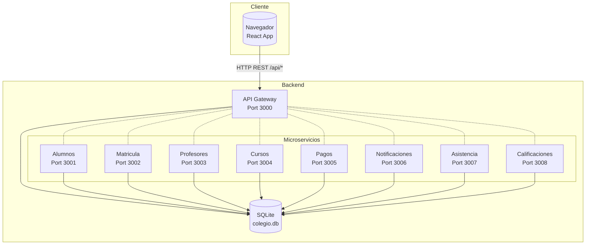
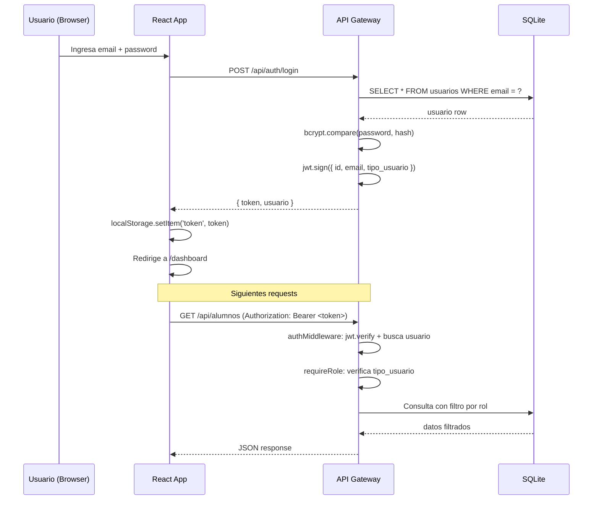
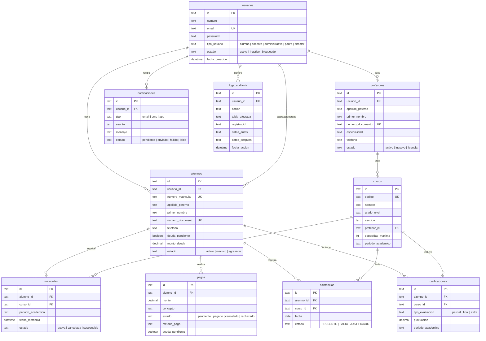
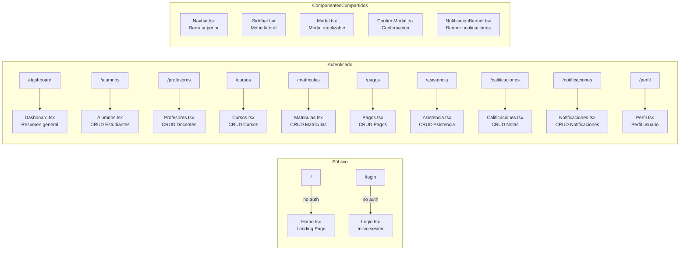

# Sistema SOA - Colegio Futuro Digital

Sistema de gestión académica con arquitectura orientada a servicios (SOA). Cuenta con un **API Gateway** que centraliza autenticación JWT, autorización por roles y toda la lógica CRUD sobre una base de datos SQLite compartida. El frontend en **React + TypeScript** consume los endpoints del Gateway.

---

## Arquitectura General



> **Nota:** Actualmente el Gateway contiene toda la lógica CRUD y consulta la BD directamente. Los microservicios existen como procesos independientes pero el Gateway **no** les delega peticiones (proxy deshabilitado). Cada microservicio puede ejecutarse de forma autónoma con su propio Express.

---

## Tech Stack

| Capa | Tecnología | Versión |
|------|-----------|---------|
| **Backend** | Node.js + Express | 18+ / 4.18 |
| **Frontend** | React + TypeScript | 18 / 5.x |
| **Base de Datos** | SQLite | 3.x |
| **Autenticación** | JWT + bcryptjs | — |
| **Estilos** | Bootstrap 5 + Bootstrap Icons | 5.3 |
| **Routing (Frontend)** | react-router-dom | 6.11 |
| **HTTP Client** | Axios | 1.4 |
| **Testing** | Jest + Supertest | 29.5 |
| **Contenedores** | Docker / docker-compose | — |

---

## Funcionalidades

- **Autenticación JWT** — Login con email/contraseña, token de 7 días
- **5 roles** — director, administrativo, docente, alumno, padre — cada uno con permisos específicos
- **CRUD completo** — Alumnos, Profesores, Cursos, Matrículas, Pagos, Asistencia, Calificaciones, Notificaciones
- **Filtrado por rol** — Cada usuario ve solo los datos que le corresponden (ej: un alumno ve sus notas, un padre ve los datos de sus hijos)
- **Validación en backend y frontend** — DNI (8 dígitos), teléfono (9 dígitos, empieza con 9), nombres sin números
- **Notificaciones** — con estado leído/no leído y banner de pendientes al iniciar sesión
- **Auditoría** — Tabla `logs_auditoria` lista en BD, función `registrarAuditoria()` en `shared/utils.js`
- **Sidebar dinámico** — Se adapta según el rol del usuario
- **Tablas ordenables** — Click en encabezados para ordenar cualquier columna

---

## Inicio Rápido

```bash
# 1. Instalar dependencias (raíz)
npm install

# 2. Instalar dependencias del frontend
cd frontend && npm install && cd ..

# 3. Copiar .env y configurar
copy .env.example .env

# 4. Inicializar BD con datos de prueba
npm run db:init

# 5. Iniciar backend (Gateway + 8 servicios)
npm run dev

# 6. En otra terminal, iniciar frontend
cd frontend && npm start
```

El frontend se abrirá en `http://localhost:3001` (porque el Gateway ocupa el 3000).

### Docker

```bash
docker compose up --build
```

---

## Diagrama de Autenticación (JWT)



---

## Roles y Permisos

| Rol | Acceso principal | Restricciones |
|-----|-----------------|---------------|
| `director` | Ve y administra todo el sistema | Sin restricciones funcionales |
| `administrativo` | Gestiona alumnos, matrículas, cursos y pagos | No actúa como padre ni alumno |
| `docente` | Consulta sus cursos, asistencia y calificaciones | No puede borrar registros críticos |
| `alumno` | Ve solo su información académica y pagos | No puede editar otros usuarios |
| `padre` | Ve el dashboard de su hijo/a, pagos, asistencia, calificaciones | Solo lectura, no edita ni elimina |

El Gateway define `ROLES_CON_ACCESO_TOTAL = new Set(['director', 'administrativo'])` — estos roles ven todos los registros. Los demás roles tienen filtros aplicados en las consultas SQL.

---

## API Endpoints

### Autenticación (públicos)

| Método | Ruta | Descripción |
|--------|------|-------------|
| POST | `/api/auth/login` | Iniciar sesión (email + password) → JWT |
| POST | `/api/auth/registro` | Registrar nuevo usuario |
| GET | `/api/health` | Health check del Gateway |

### CRUD por Entidad

#### Alumnos
| Método | Ruta | Roles |
|--------|------|-------|
| GET | `/api/alumnos` | Cualquier auth (filtrado por rol) |
| GET | `/api/alumnos/:id` | Cualquier auth (filtrado) |
| POST | `/api/alumnos` | administrativo, director |
| PUT | `/api/alumnos/:id` | administrativo, director |
| DELETE | `/api/alumnos/:id` | administrativo, director |

#### Profesores
| Método | Ruta | Roles |
|--------|------|-------|
| GET | `/api/profesores` | Cualquier auth (filtrado) |
| GET | `/api/profesores/:id` | Cualquier auth (filtrado) |
| POST | `/api/profesores` | director |
| PUT | `/api/profesores/:id` | director |
| DELETE | `/api/profesores/:id` | administrativo, director |

#### Cursos
| Método | Ruta | Roles |
|--------|------|-------|
| GET | `/api/cursos` | Cualquier auth (filtrado) |
| GET | `/api/cursos/:id` | Cualquier auth (filtrado) |
| POST | `/api/cursos` | director, administrativo |
| PUT | `/api/cursos/:id` | director, administrativo |
| DELETE | `/api/cursos/:id` | administrativo, director |

#### Matrículas
| Método | Ruta | Roles |
|--------|------|-------|
| GET | `/api/matriculas` | Cualquier auth (filtrado) |
| POST | `/api/matriculas` | administrativo, director |
| DELETE | `/api/matriculas/:id` | administrativo, director |

#### Pagos
| Método | Ruta | Roles |
|--------|------|-------|
| GET | `/api/pagos` | Cualquier auth (filtrado) |
| POST | `/api/pagos` | Cualquier auth |
| PUT | `/api/pagos/:id` | Cualquier auth |
| DELETE | `/api/pagos/:id` | administrativo, director |

#### Asistencia
| Método | Ruta | Roles |
|--------|------|-------|
| GET | `/api/asistencia` | Cualquier auth (filtrado) |
| POST | `/api/asistencia` | docente, director, administrativo |
| PUT | `/api/asistencia/:id` | docente, director, administrativo |
| DELETE | `/api/asistencia/:id` | docente, director, administrativo |

#### Calificaciones
| Método | Ruta | Roles |
|--------|------|-------|
| GET | `/api/calificaciones` | Cualquier auth (filtrado) |
| POST | `/api/calificaciones` | docente, director, administrativo |
| PUT | `/api/calificaciones/:id` | docente, director, administrativo |
| DELETE | `/api/calificaciones/:id` | docente, director, administrativo |

#### Notificaciones
| Método | Ruta | Roles |
|--------|------|-------|
| GET | `/api/notificaciones` | Cualquier auth (filtrado) |
| POST | `/api/notificaciones` | administrativo, director, docente |
| PUT | `/api/notificaciones/:id` | administrativo, director, docente, padre, alumno |
| DELETE | `/api/notificaciones/:id` | administrativo, director, docente |

#### Utilidad
| Método | Ruta | Descripción |
|--------|------|-------------|
| GET | `/api/me` | Usuario autenticado actual |
| GET | `/api/usuarios` | Lista de usuarios (filtrado por rol) |

---

## Diagrama de Base de Datos (ER)



---

## Frontend - Estructura de Rutas



### Layout de página autenticada

```
┌──────────────────────────────────────────────┐
│  Navbar (sticky, usuario + rol + avatar)      │
├──────────┬───────────────────────────────────┤
│          │  NotificationBanner (alert)       │
│ Sidebar  ├───────────────────────────────────┤
│ (250px)  │                                   │
│          │  <Routes> (contenido principal)   │
│ Filtrado │                                   │
│ por rol  │                                   │
│          │                                   │
└──────────┴───────────────────────────────────┘
```

---

## Frontend - Árbol de Componentes

```
frontend/src/
├── api/
│   ├── client.ts          ← Axios instance, interceptors, resolveApiBaseUrl()
│   └── services.ts        ← authService + createCrudService() para 9 entidades
├── components/
│   ├── ConfirmModal.tsx    ← Diálogo de confirmación para delete
│   ├── Modal.tsx           ← Modal Bootstrap reutilizable (create/edit forms)
│   ├── Navbar.tsx          ← Barra superior con usuario, rol, avatar, logout
│   ├── NotificationBanner.tsx  ← Banner de notificaciones no leídas (pool 30s)
│   ├── PrivateRoute.tsx    ← Guard de ruta (no usado actualmente)
│   └── Sidebar.tsx         ← Menú lateral filtrado por rol
├── context/
│   └── AuthContext.tsx     ← AuthProvider + useAuth hook (login, logout, token)
├── pages/
│   ├── Home.tsx            ← Landing page público
│   ├── Login.tsx           ← Login con botones de demo
│   ├── Dashboard.tsx       ← Resumen con cards de métricas
│   ├── Alumnos.tsx         ← CRUD estudiantes
│   ├── Profesores.tsx      ← CRUD docentes
│   ├── Cursos.tsx          ← CRUD cursos
│   ├── Matriculas.tsx      ← CRUD matrículas
│   ├── Pagos.tsx           ← CRUD pagos
│   ├── Asistencia.tsx      ← CRUD asistencia
│   ├── Calificaciones.tsx  ← CRUD calificaciones
│   ├── Notificaciones.tsx  ← CRUD notificaciones + toggle leído/no leído
│   └── Perfil.tsx          ← Perfil usuario + vista académica (alumno/padre)
├── utils/
│   ├── codeGenerators.ts   ← Generación de códigos autoincrementales
│   ├── permissions.ts      ← Sistema de permisos por rol (can, filterMenuByRole)
│   ├── tableSort.ts        ← Ordenamiento de columnas (sortRows, useSortableData)
│   └── validators.ts       ← Validación de formularios (DNI, teléfono, nombre, etc.)
├── App.tsx                 ← Routing principal (público + privado)
├── index.tsx               ← Punto de entrada React
└── index.css               ← Estilos globales
```

---

## Usuarios de Prueba

Se cargan con `npm run db:init`. Todos los passwords son `password123`:

| Usuario | Rol | Email |
|---------|-----|-------|
| Dr. Luis Fernando Herrera | `director` | `luis.herrera@colegiofuturo.edu` |
| Lic. Andrea Montalvo | `administrativo` | `andrea.montalvo@colegiofuturo.edu` |
| Prof. Juan Carlos Paredes | `docente` | `juan.paredes@colegiofuturo.edu` |
| Prof. María Elena Ríos | `docente` | `maria.rios@colegiofuturo.edu` |
| Valeria Sánchez | `alumno` | `valeria.sanchez@colegiofuturo.edu` |
| Diego Torres | `alumno` | `diego.torres@colegiofuturo.edu` |
| Patricia Sánchez | `padre` | `patricia.sanchez@colegiofuturo.edu` |

Adicionalmente hay **6 familias extra** con estudiantes y padres (Camila Herrera, Andres Lopez, Sofia Navarro, Mateo Salas, Lucia Vargas, Thiago Mendoza) — ver `database/init.js`.

---

## Variables de Entorno (`.env`)

| Variable | Default | Descripción |
|----------|---------|-------------|
| `GATEWAY_PORT` | `3000` | Puerto del API Gateway |
| `GATEWAY_HOST` | `localhost` | Host del Gateway |
| `DB_PATH` | `./database/colegio.db` | Ruta al archivo SQLite |
| `JWT_SECRET` | *(requerido)* | Clave para firmar tokens JWT |
| `JWT_EXPIRE` | `7d` | Duración del token |
| `ALLOWED_ORIGINS` | `http://localhost:3000,...` | Orígenes permitidos por CORS |
| `RESET_DB` | — | `true` para regenerar BD en `db:init` |

---

## Servicios y Puertos

| Servicio | Puerto |
|----------|--------|
| API Gateway | `3000` |
| Alumnos | `3001` |
| Matrícula | `3002` |
| Profesores | `3003` |
| Cursos | `3004` |
| Pagos | `3005` |
| Notificaciones | `3006` |
| Asistencia | `3007` |
| Calificaciones | `3008` |

---

## Estructura del Proyecto

```
SOA/
├── api-gateway/             ← Gateway principal (Express, 1548 líneas)
│   ├── gateway.js           ← Toda la lógica CRUD + rutas
│   └── middleware/
│       ├── auth.js          ← JWT + roles
│       └── errorHandler.js  ← Manejo global de errores
├── services/                ← 8 microservicios independientes
│   ├── alumnos-service/
│   ├── matricula-service/
│   ├── profesores-service/
│   ├── cursos-service/
│   ├── pagos-service/
│   ├── notificaciones-service/
│   ├── asistencia-service/
│   └── calificaciones-service/
├── frontend/                ← React 18 + TypeScript
│   └── src/
│       ├── api/             ← Axios client + services
│       ├── components/      ← Componentes reutilizables
│       ├── context/         ← AuthContext (login/logout)
│       ├── pages/           ← 12 páginas
│       └── utils/           ← Validadores, permisos, sort
├── database/                ← Schema SQLite + seed data
│   ├── schema.sql           ← 11 tablas
│   └── init.js              ← Inicialización + seed
├── config/                  ← Configuración de BD
│   └── database.js          ← Conexión SQLite + helpers
├── shared/                  ← Código compartido
│   ├── utils.js             ← Helpers (UUID, respuestas, auditoría)
│   └── validators.js        ← Validadores (DNI, teléfono, email, etc.)
├── package.json             ← Scripts y dependencias raíz
├── docker-compose.yml       ← Contenedores
├── .env.example             ← Plantilla de variables de entorno
├── AGENTS.md                ← Guía para asistentes AI
└── README.md                ← Este archivo
```

---

## Seguridad

- **JWT**: Tokens firmados con `HS256`, payload `{ id, email, tipo_usuario }`, expiración configurable (default 7 días).
- **bcryptjs**: Passwords hasheados con 10 rounds de salt.
- **authMiddleware**: Verifica token en cada request protegido. Si expiró → `401 TOKEN_EXPIRED`. Si el usuario fue bloqueado → `403 USER_BLOCKED`.
- **requireRole(roles)**: Middleware que verifica `tipo_usuario` contra la lista de roles permitidos.
- **Filtrado por rol en consultas SQL**: Cada `GET` lista aplica condiciones `WHERE` según el rol del usuario autenticado.
- **CORS**: Lista blanca configurable vía `ALLOWED_ORIGINS` + acepta localhost, ngrok, tunnel domains.

---

## Auditoría

La base de datos incluye la tabla `logs_auditoria` y `shared/utils.js` exporta la función `registrarAuditoria(db, usuarioId, accion, tabla, registroId, datosAntes, datosDespues)` para registrar transacciones críticas (quién, cuándo, qué acción).

Actualmente la función está disponible pero no se invoca automáticamente desde el Gateway. Para habilitarla, agregar llamadas a `registrarAuditoria` en cada endpoint POST/PUT/DELETE del Gateway.

---

## Troubleshooting

- **Login no responde**: Verificar que el Gateway esté corriendo en `http://localhost:3000` y que `ALLOWED_ORIGINS` incluya el puerto del frontend.
- **CORS en túnel VS Code**: Usar el puerto 3000 (Gateway) o asegurarse de tener el proxy configurado en `frontend/package.json`.
- **Reiniciar BD**: `npm run db:init` (no destructivo) o `RESET_DB=true npm run db:init` (borra y recrea).
- **Verificar datos**: `npm run db:verify` muestra conteos por tabla.
