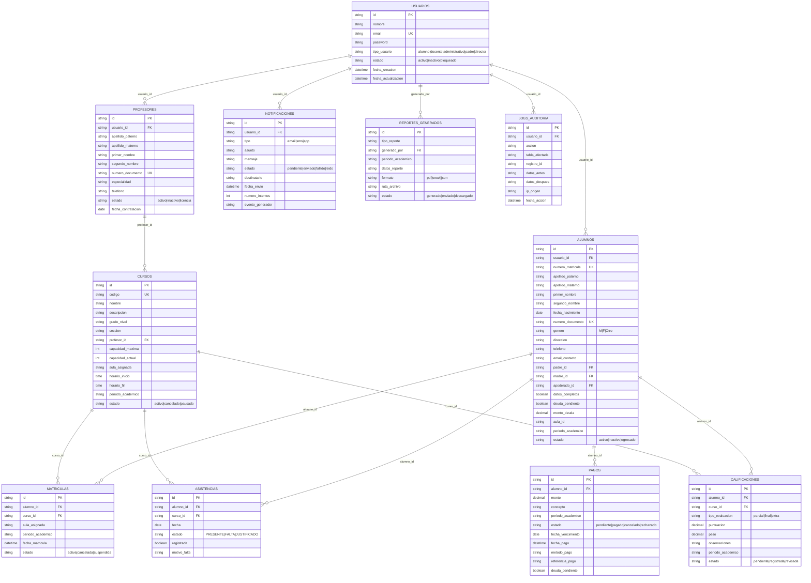
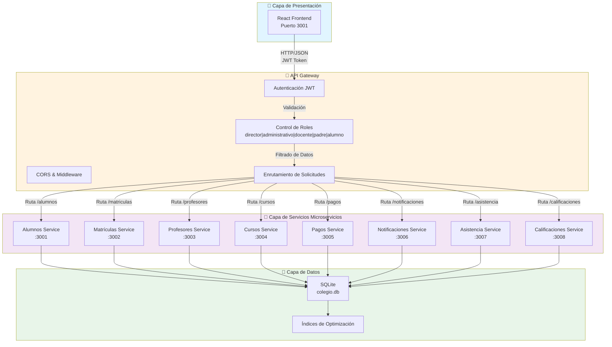
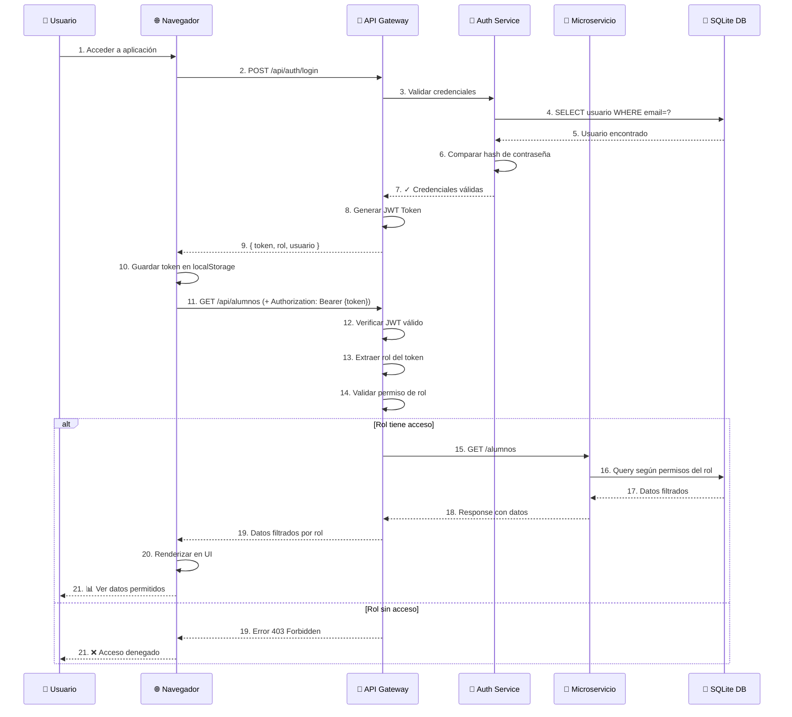
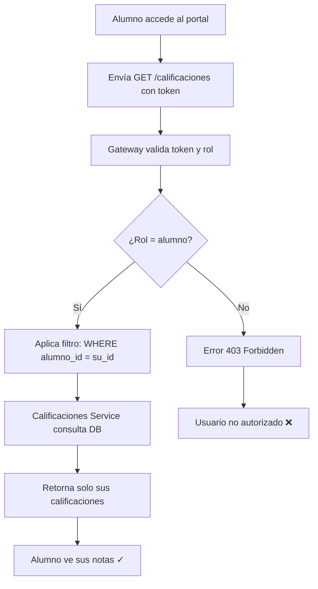
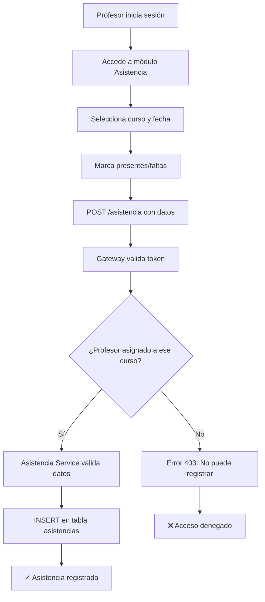
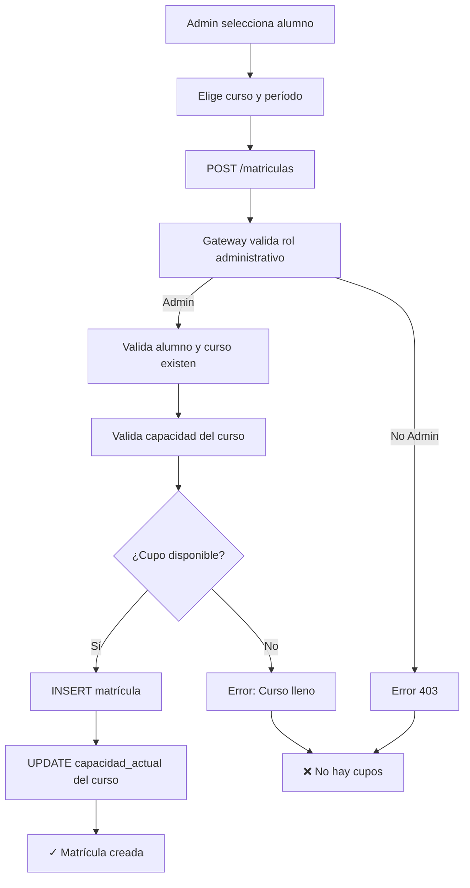

# Sistema SOA - Colegio Futuro Digital

Sistema de gestión académica basado en una arquitectura orientada a servicios (SOA) con API Gateway, frontend en React y base de datos SQLite.

## 📋 Contenido de esta Documentación

- [¿Qué es SOA? (Conceptos)](#-qué-es-soa-conceptos)
- [Modelo de Datos (ER Diagram)](#-modelo-de-datos-diagrama-entidad-relación)
- [Arquitectura por Capas](#-diagrama-de-arquitectura-por-capas)
- [Orquestación de Procesos](#-diagrama-de-orquestación-de-procesos)
- [Instalación y Arranque](#-instalación-y-arranque)
- [Servicios del Sistema](#-servicios-del-sistema)

---

## 💡 ¿Qué es SOA? (Conceptos)

**SOA (Service-Oriented Architecture)** es un patrón arquitectónico empresarial donde el sistema se construye como un conjunto de servicios independientes que se comunican entre sí.

### Principios de SOA en este proyecto:

| Principio | Implementación en el Sistema |
|-----------|------------------------------|
| **Modularidad** | Cada dominio (alumnos, cursos, pagos, etc.) es un servicio independiente |
| **Reusabilidad** | Servicios exponen funcionalidad reutilizable a través de APIs REST |
| **Escalabilidad** | Cada servicio puede escalarse independientemente según demanda |
| **Mantenibilidad** | Cambios en un servicio no afectan a otros (bajo acoplamiento) |
| **Independencia Tecnológica** | Servicios pueden cambiar internamente sin afectar la interfaz |
| **Interoperabilidad** | Comunicación mediante estándares abiertos (HTTP/JSON) |

### Características Clave de este Sistema SOA:

🎯 **API Gateway Centralizado**
- Punto de entrada único para toda la aplicación
- Maneja autenticación y autorización centralmente
- Enruta solicitudes a los servicios correspondientes

🧩 **8 Microservicios Independientes**
- Alumnos, Matrículas, Profesores, Cursos, Pagos, Notificaciones, Asistencia, Calificaciones
- Cada uno con su propio servidor Express
- Comunicación sin estado (stateless)

🔐 **Seguridad Centralizada**
- JWT para autenticación
- Control basado en roles (RBAC) en el gateway
- Filtrado de datos por permisos del usuario

💾 **Base de Datos Compartida**
- SQLite centralizada
- Todos los servicios acceden a la misma BD
- Mantiene consistencia de datos

📊 **Integración de Datos**
- El gateway puede consultar múltiples servicios para consolidar datos
- Ejemplo: Dashboard que obtiene alumnos, cursos, matrículas, pagos en una sola llamada

---

## 📊 Modelo de Datos (Diagrama Entidad-Relación)

El siguiente diagrama ER muestra todas las entidades del sistema, sus atributos principales, relaciones y cardinalidades:



### Cardinalidades Principales:
- **Usuario → Alumno** (1:0..1): Un usuario puede ser alumno o no
- **Usuario → Profesor** (1:0..1): Un usuario puede ser profesor o no
- **Alumno → Matrícula** (1:N): Un alumno se matricula en múltiples cursos
- **Profesor → Curso** (1:N): Un profesor dicta múltiples cursos
- **Curso → Matrícula** (1:N): Un curso tiene múltiples matrículas
- **Alumno → Asistencia, Calificación, Pago** (1:N): Un alumno tiene múltiples registros en estas tablas

---

## 🏛️ Diagrama de Arquitectura por Capas

La arquitectura del sistema está organizada en capas independientes que se comunican a través del API Gateway:



### Características de Cada Capa:

**🎨 Capa de Presentación (Frontend)**
- Aplicación React para interfaz de usuario
- Consumo de APIs RESTful a través del gateway
- Gestión de estado y autenticación del lado cliente

**🔐 API Gateway**
- Punto de entrada único para todas las solicitudes
- Autenticación mediante JWT
- Control de acceso basado en roles (RBAC)
- Validación y CORS
- Enrutamiento dinámico hacia servicios

**🧩 Capa de Servicios (Microservicios)**
- 8 servicios especializados independientes
- Cada servicio expone un conjunto de endpoints REST
- Comunicación sin estado (stateless)
- Compartición de base de datos centralizada (patrón moderno de SOA)

**💾 Capa de Datos**
- Base de datos SQLite centralizada
- Índices para optimización de consultas
- Persistencia de todas las entidades del sistema

---

## 🔄 Diagrama de Orquestación de Procesos

Este diagrama muestra el flujo principal de autenticación y operación del sistema:



### Flujos de Caso de Uso Clave:

**1️⃣ Caso: Alumno visualiza sus calificaciones**


**2️⃣ Caso: Docente registra asistencia**


**3️⃣ Caso: Administrador gestiona matrículas**


---

## 🏗️ Patrones y Mejores Prácticas Implementadas

### 1. **API Gateway Pattern** ✅
- Centraliza autenticación y autorización
- Actúa como proxy entre cliente y servicios
- Maneja CORS y transformación de datos

### 2. **JWT (JSON Web Tokens)** ✅
- Autenticación sin estado (stateless)
- Token incluye: id usuario, rol, permisos
- Cada solicitud debe incluir: `Authorization: Bearer {token}`

### 3. **Role-Based Access Control (RBAC)** ✅
Roles implementados:
- **director**: acceso total al sistema
- **administrativo**: gestión académica y administrativa
- **docente**: consulta de cursos, registro de asistencia y notas
- **alumno**: visualización de datos propios
- **padre**: visualización de datos de hijo/a

### 4. **Microservicios Independientes** ✅
- Cada servicio expone endpoints REST
- Sin dependencias directas entre servicios
- Comunicación a través del gateway

### 5. **Base de Datos Centralizada** ✅
- SQLite compartida por todos los servicios
- Índices para optimizar consultas frecuentes
- Transacciones para mantener integridad

### 6. **Validación y Sanitización** ✅
- Validación de email, UUID, datos académicos
- Sanitización de entrada de usuarios
- Errores con mensajes claros

### 7. **Respuestas Estándar** ✅
Formato JSON consistente:
```json
{
  "exito": true,
  "codigo": "OPERACION_EXITOSA",
  "mensaje": "Alumnos obtenidos",
  "datos": { ... }
}
```

---

## Requisitos

- Node.js 16 o superior
- npm 7 o superior
- Docker y docker-compose, solo si quieres usar contenedores


## Instalación y arranque (Windows - PowerShell)

Sigue estos pasos desde la carpeta raíz del proyecto (`C:\Users\USUARIO\Downloads\SOA\SOA`).

1) Instala dependencias en la raíz:

```powershell
npm install
```

2) Instala dependencias del frontend:

```powershell
Set-Location .\frontend
npm install
Set-Location ..
```

3) Crea el archivo `.env` en la raíz copiando el ejemplo incluido:

```powershell
Copy-Item .env.example .env
```

Si quieres editarlo después, como mínimo asegúrate de tener `JWT_SECRET`, `GATEWAY_PORT=3000`, `DB_PATH=./database/colegio.db` y `ALLOWED_ORIGINS` con `http://localhost:3000` y `http://localhost:3001`.

4) Inicializa la base de datos y carga los datos de prueba. Ejecuta este paso solo desde la raíz:

```powershell
npm run db:init
```

5) Levanta el backend completo. Este comando inicia el API Gateway y todos los microservicios definidos en `package.json`:

```powershell
npm run dev
```

6) En otro terminal, levanta el frontend:

```powershell
Set-Location .\frontend
npm start
```

El frontend normalmente se abrirá en `http://localhost:3001` porque `3000` ya está ocupado por el gateway. Si ese puerto también está ocupado, React elegirá otro libre y te lo mostrará en consola.

7) Abre la aplicación en el navegador y usa el usuario de prueba del directorio de abajo.

Nota: el archivo `start-all.bat` no refleja el flujo actual del proyecto; usa los comandos anteriores para evitar errores de arranque.


## Alternativa: Docker (recomendado para despliegue uniforme)

Si prefieres usar Docker, parte del archivo `.env.example` y ajusta `JWT_SECRET` antes de arrancar:

```powershell
Copy-Item .env.example .env
docker-compose up --build
```

Nota: Docker Compose montará `./database` para persistir la base de datos SQLite.

## Usuarios de prueba

Las credenciales de ejemplo se cargan con `npm run db:init`.

| Usuario | Rol | Relación / contexto | Qué ve y qué puede hacer | Credenciales |
| --- | --- | --- | --- | --- |
| Dr. Luis Fernando Herrera | `director` | Director general del colegio y cuenta administradora del sistema | Acceso total al sistema, dashboards, alumnos, profesores, cursos, matrículas, pagos, asistencia, calificaciones y notificaciones | `luis.herrera@colegiofuturo.edu` / `password123` |
| Lic. Andrea Montalvo | `administrativo` | Área administrativa y de control académico | Gestión de alumnos, matrículas, cursos, pagos y consultas administrativas | `andrea.montalvo@colegiofuturo.edu` / `password123` |
| Prof. Juan Carlos Paredes | `docente` | Docente asignado a secciones de secundaria del seed | Consulta de cursos asignados, asistencia, calificaciones y datos relacionados a sus estudiantes | `juan.paredes@colegiofuturo.edu` / `password123` |
| Prof. María Elena Ríos | `docente` | Docente asignada a otras secciones de secundaria del seed | Consulta de cursos asignados, asistencia, calificaciones y datos relacionados a sus estudiantes | `maria.rios@colegiofuturo.edu` / `password123` |
| Valeria Sánchez | `alumno` | Estudiante vinculada a Patricia Sánchez | Visualiza sus propios datos, matrículas, pagos, asistencia, calificaciones y notificaciones relacionadas | `valeria.sanchez@colegiofuturo.edu` / `password123` |
| Diego Torres | `alumno` | Estudiante del seed sin tutor principal visible en el perfil | Visualiza sus propios datos, matrículas, pagos, asistencia, calificaciones y notificaciones relacionadas | `diego.torres@colegiofuturo.edu` / `password123` |
| Patricia Sánchez | `padre` | Apoderada/tutora de Valeria Sánchez | Visualiza solo la información de su hija o hijo, sus pagos, asistencia, calificaciones y notificaciones asociadas. El perfil muestra un panel tipo dashboard y no permite acciones de edición o eliminación | `patricia.sanchez@colegiofuturo.edu` / `password123` |

## Qué verás en cada módulo

- Dashboard: resumen general con conteos de alumnos, cursos, profesores y pagos.
- Alumnos: listado de alumnos sembrados en la base de datos.
- Profesores: listado de docentes con usuario, nombre, especialidad y contacto.
- Cursos: cursos con código, grado, sección y salón.
- Matrículas: relación alumno-curso cargada desde SQLite con periodo académico y sección académica.
- Pagos: pagos iniciales con estado pagado y pendiente.
- Asistencia: registros de asistencia sembrados para probar el listado.
- Calificaciones: notas de ejemplo visibles en el módulo.
- Notificaciones: notificaciones de prueba visibles en la interfaz.

Los listados ya respetan la relación del usuario autenticado: un alumno ve solo sus datos, un padre ve solo los datos de su hijo, y un docente ve solo la información ligada a sus cursos y alumnos relacionados. Además, las tablas principales permiten ordenar los registros haciendo clic en el encabezado de cada columna.

## Roles Del Sistema

| Rol | Acceso principal | Restricciones |
| --- | --- | --- |
| `director` | Ve y administra todo el sistema | Sin restricciones funcionales |
| `administrativo` | Gestiona alumnos, matrículas, cursos y pagos | No actúa como padre ni alumno |
| `docente` | Consulta sus cursos, asistencia y calificaciones | No puede borrar registros críticos |
| `alumno` | Ve solo su información académica y de pagos permitidos | No puede editar otros usuarios |
| `padre` | Ve el dashboard/resumen de su hija o hijo, asistencia, pagos, calificaciones y notificaciones relacionadas | No puede editar ni eliminar la información de su hija o hijo |

En el perfil del padre se muestra una vista general del estudiante vinculado, con asistencia reciente y estado general.

Relaciones de ejemplo en el seed:

- Patricia Sánchez es la tutora visible de Valeria Sánchez.
- Valeria Sánchez está matriculada en Secundaria 1ro Grado A con periodo académico `2026-1`.
- Diego Torres está matriculado en Secundaria 2do Grado A con periodo académico `2026-1`.
- Los docentes Juan Carlos Paredes y María Elena Ríos cubren las secciones académicas sembradas de 1ro a 5to.

## Servicios del sistema

El proyecto está organizado como una arquitectura orientada a servicios. El navegador habla con el API Gateway y este centraliza autenticación, permisos y acceso a la base de datos.

| Servicio | Puerto | Responsabilidad |
| --- | --- | --- |
| API Gateway | `3000` | Punto de entrada único, autenticación JWT, CORS, autorización por rol y consultas consolidadas de datos |
| Alumnos | `3001` | Gestión de estudiantes, relación con usuarios y vinculación con padres |
| Matrículas | `3002` | Inscripciones alumno-curso, estados y observaciones |
| Profesores | `3003` | Gestión de docentes, datos de contacto y especialidades |
| Cursos | `3004` | Catálogo de cursos, grados, secciones, salones y profesor responsable |
| Pagos | `3005` | Registro de pagos, deuda pendiente, conceptos y estados de cobro |
| Notificaciones | `3006` | Mensajes informativos, recordatorios y alertas para usuarios vinculados |
| Asistencia | `3007` | Registro y consulta de asistencias, faltas y justificaciones |
| Calificaciones | `3008` | Registro de notas, períodos académicos y observaciones |

Flujo resumido: el frontend llama al Gateway, el Gateway valida el token, aplica el filtro por rol y devuelve únicamente la información permitida por usuario.

Las secciones académicas del seed están limitadas a secundaria de 1ro a 5to y las matrículas incluyen su periodo académico para mantener la relación correcta entre alumno, curso y año lectivo.

## Variables importantes

- `JWT_SECRET`: clave para firmar el token.
- `GATEWAY_PORT`: puerto del API Gateway.
- `ALLOWED_ORIGINS`: lista de orígenes permitidos por CORS, por ejemplo `http://localhost:3001`.

## Troubleshooting

- Si el login no responde desde el frontend, revisa que el gateway esté corriendo en `http://localhost:3000` y que `ALLOWED_ORIGINS` incluya el puerto del frontend.
- Si el frontend arrancó en otro puerto, no debería fallar: el gateway acepta `localhost`/`127.0.0.1` en cualquier puerto.
- Si quieres reiniciar la base de datos, vuelve a ejecutar `npm run db:init` desde la raíz.
- `npm run db:init` puede mostrar advertencias de índices antiguos; en este proyecto eso no siempre significa error, mientras el proceso termine bien.

## Estructura general

- `api-gateway/`: autenticación, middleware y endpoints principales.
- `services/`: microservicios del dominio académico.
- `frontend/`: interfaz React.
- `database/`: esquema, inicialización y verificación de datos.
- `config/` y `shared/`: utilidades comunes del backend.
